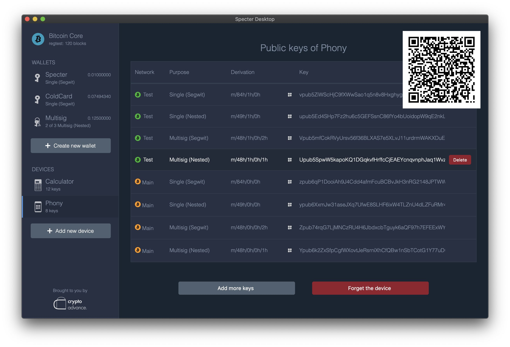
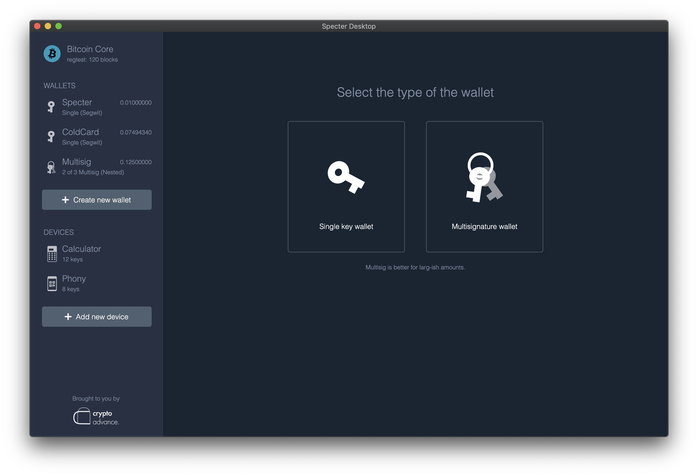
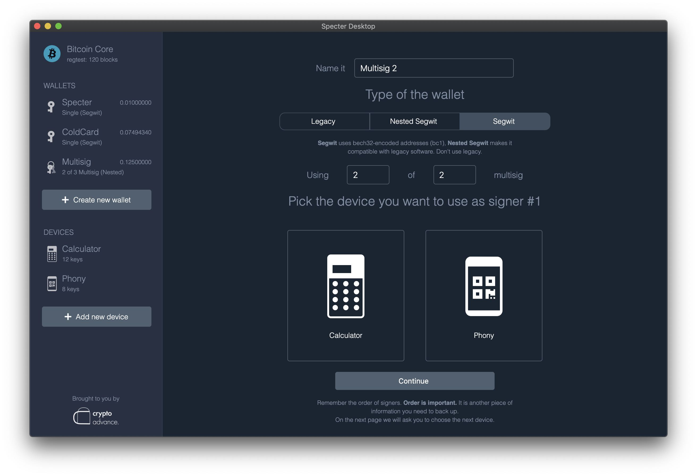
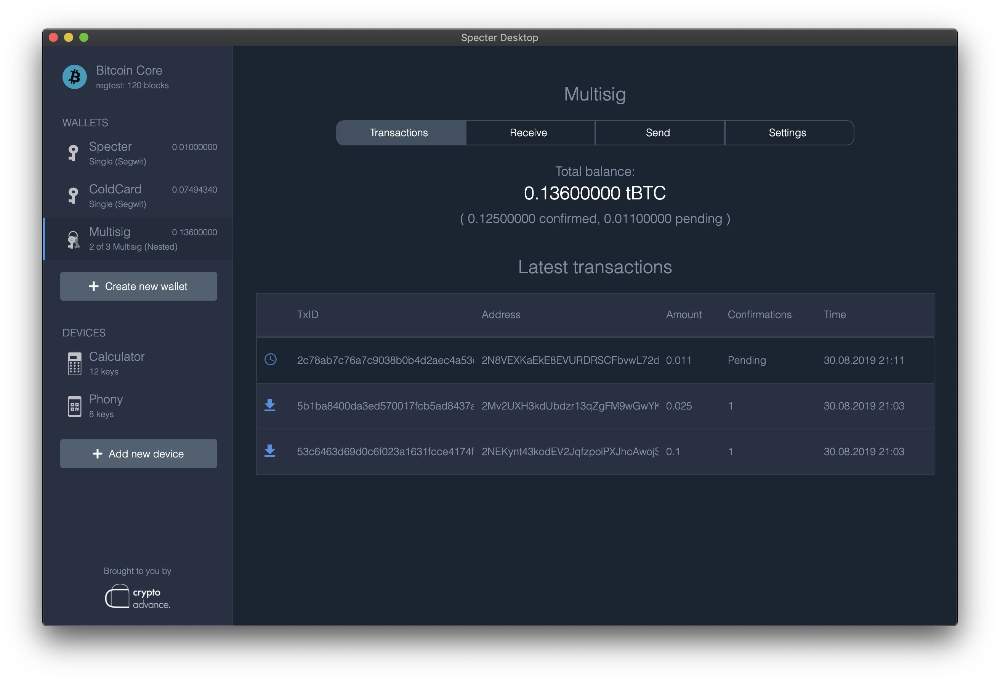
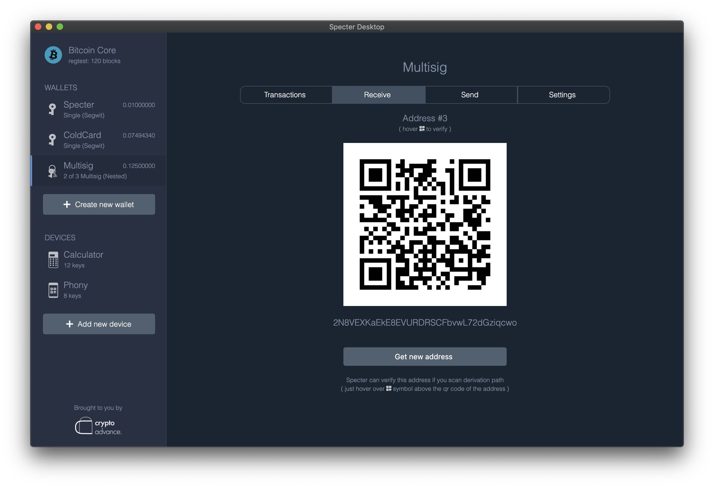
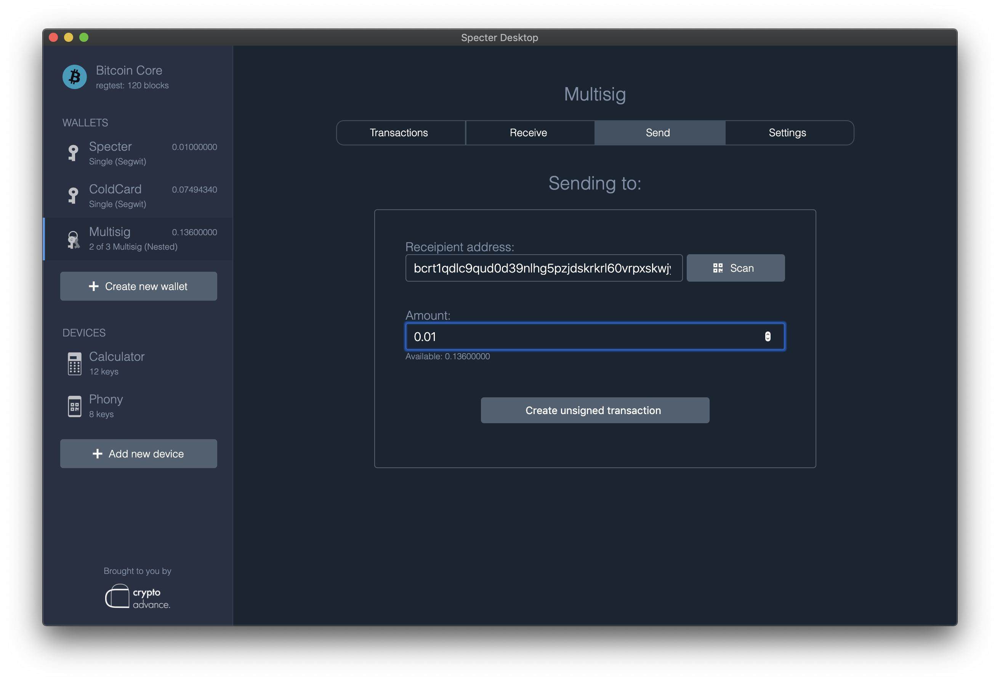
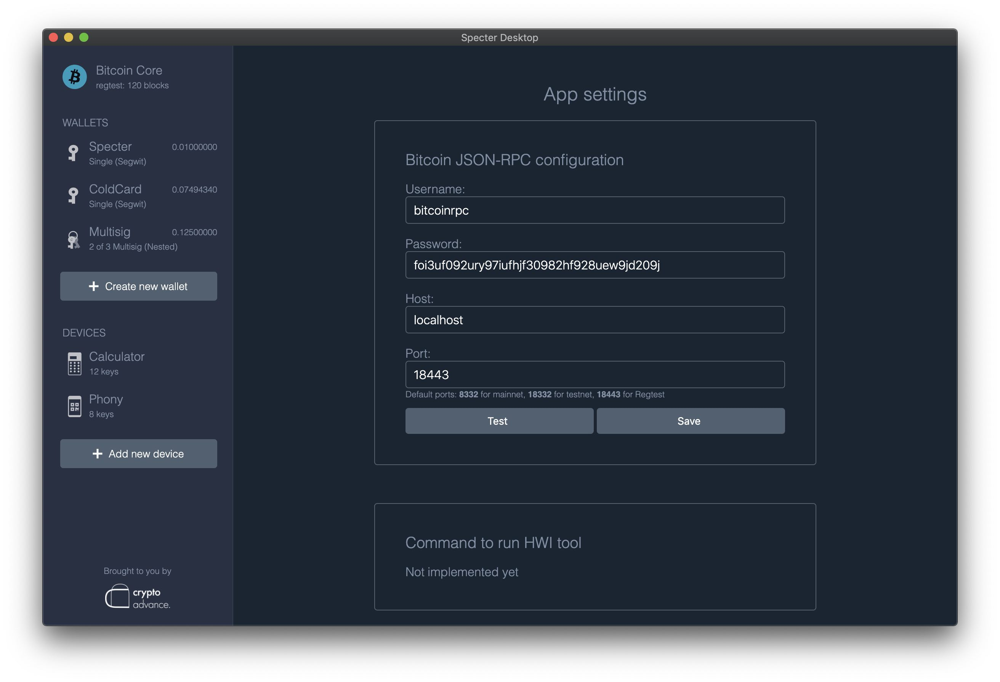

<!-- START doctoc generated TOC please keep comment here to allow auto update -->
<!-- DON'T EDIT THIS SECTION, INSTEAD RE-RUN doctoc TO UPDATE -->
**Table of Contents**

- [Specter Desktop](#specter-desktop)
  - [DISCLAIMER](#disclaimer)
  - [Why?](#why)
  - [How to run](#how-to-run)
  - [Detailed instructions](#detailed-instructions)
  - [A few screenshots](#a-few-screenshots)
    - [Adding a new device](#adding-a-new-device)
    - [Creating a new wallet](#creating-a-new-wallet)
    - [Wallet interface](#wallet-interface)
    - [Configuration](#configuration)

<!-- END doctoc generated TOC please keep comment here to allow auto update -->

# Specter Desktop

    "A specter is haunting the modern world, the specter of crypto anarchy."
    The Crypto Anarchist Manifesto - Timothy C. May - Sun, 22 Nov 92 12:11:24 PST
 
[](https://travis-ci.org/cryptoadvance/specter-desktop)

## DISCLAIMER

This software might be ready to be used but at your own risk. The UI is currently only tested and optimised in Chrome, and looks a bit weird but usable in firefox. So in other browsers, it may even look more weird.

If something doesn't work open an issue here or ask a question in our [Telegram group](https://t.me/spectersupport).

## Why?

Bitcoin Core has a very powerful command line interface and a wonderful daemon. Using PSBT and HWI it can also work with hardware wallets, but at the moment it is too linux-way. The same applies to multisignature setups. 

The goal of this project is to make a convenient and user-friendly GUI around Bitcoin Core with a focus on multisignature setup with airgapped hardware wallets.

At the moment Specter-Desktop is working with all major Hardware-Wallets including [Specter-DIY hardware wallet](https://github.com/cryptoadvance/specter-diy) which uses QR codes as a main communication channel and ColdCard that uses SD cards. Also it already supports "hot" hardware wallets using [HWI tool](https://github.com/bitcoin-core/HWI) and is tested to work with Trezor One. It should also work with Keepkey and Ledger (Firmware >= 1.6.0).

## How to run
* HWI support requires `libusb` 
  * Ubuntu/Debian: `sudo apt install libusb-1.0-0-dev libudev-dev`
  * macOS: `brew install libusb`
  * windows: follow instructions in [`windows.md`](docs/windows.md)
 * Install Specter
```sh
pip3 install cryptoadvance.specter
```
* Run Specter
```sh
python3 -m cryptoadvance.specter server 
# Or as a deamon:
python3 -m cryptoadvance.specter server --daemon
# Stop the daemon again:
python3 -m cryptoadvance.specter server --stop
```
* Upgrade Specter
```sh
pip3 install cryptoadvance.specter --upgrade
```

After that, specter will be available at [http://127.0.0.1:25441/](http://127.0.0.1:25441/).

You can also run it (as a daemon), using tor, provide ssl certificates to run over https. Https is especially important because browsers don't allow the website to access camera without secure connection, and we need camera access to scan QR codes.

An example how to run specter server in the background (`--daemon`) with ssl certificates (`--key`, `--cert`) over tor:

```sh
python3 -m cryptoadvance.specter server --tor=mytorpassword --cert=./cert.pem --key=./key.pem --daemon
```

If your Bitcoin Core is using a default data folder the app should detect it automatically. If not, consider setting `rpcuser` and `rpcpassword` in the `bitcoin.conf` file or set in directly in the specter-app settings.

If you use Specter from a remote machine and want to use it with hardware wallets connected via USB, please read [this guide on setting up HWIBridge](docs/hwibridge.md) to facilitate such connection to hardware wallets. 

Have a look at [DEVELOPMENT.md](DEVELOPMENT.md) for further information about hacking on specter-desktop.

## Detailed instructions

- Beyond local network - how to forward your node through a cheap VPS: [docs/reverse-proxy.md](docs/reverse-proxy.md)
- Setting up Specter over Tor: [docs/tor.md](docs/tor.md)
- Using self-signed certificates in local network or Tor: [docs/self-signed-certificates.md](docs/self-signed-certificates.md)

## A few screenshots

### Adding a new device




### Creating a new wallet





### Wallet interface







### Configuration


