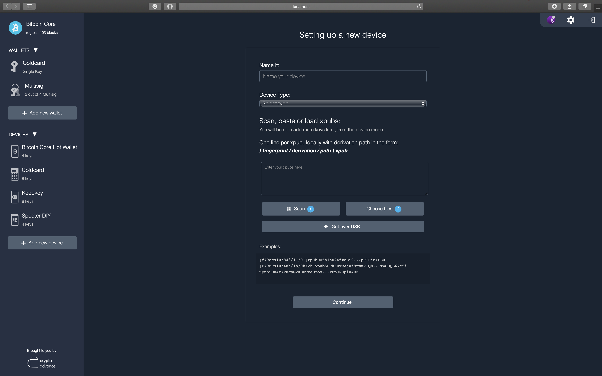
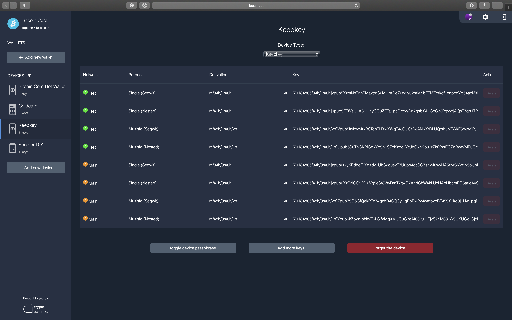
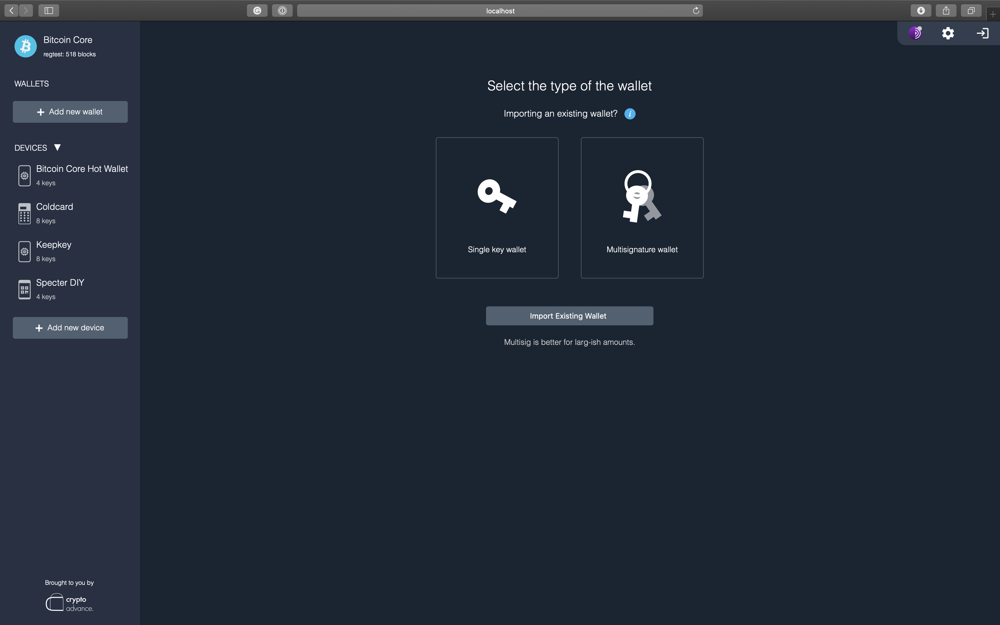
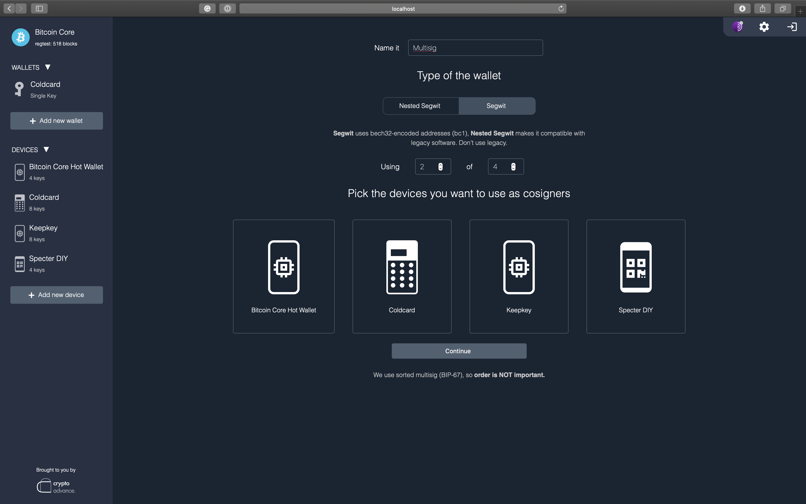
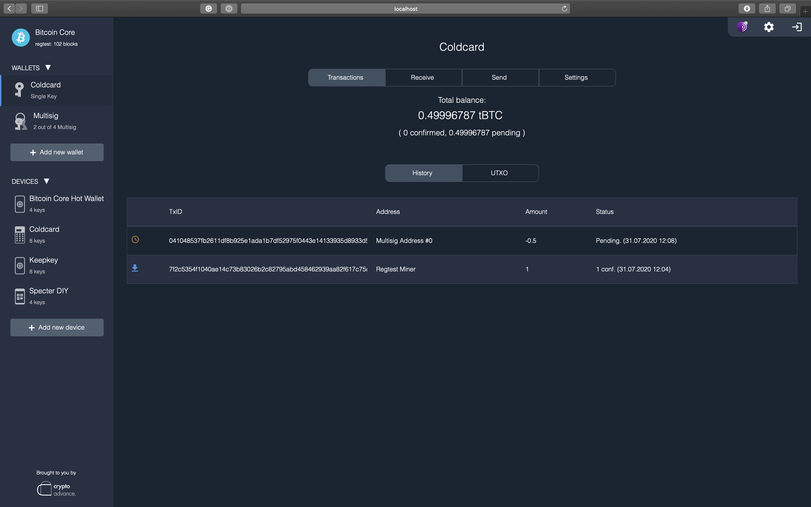
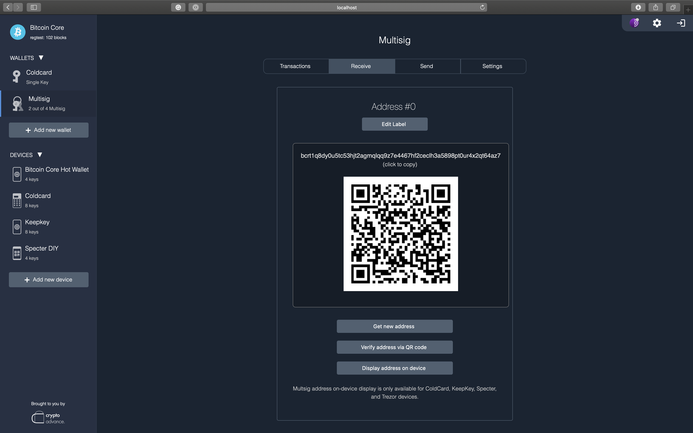
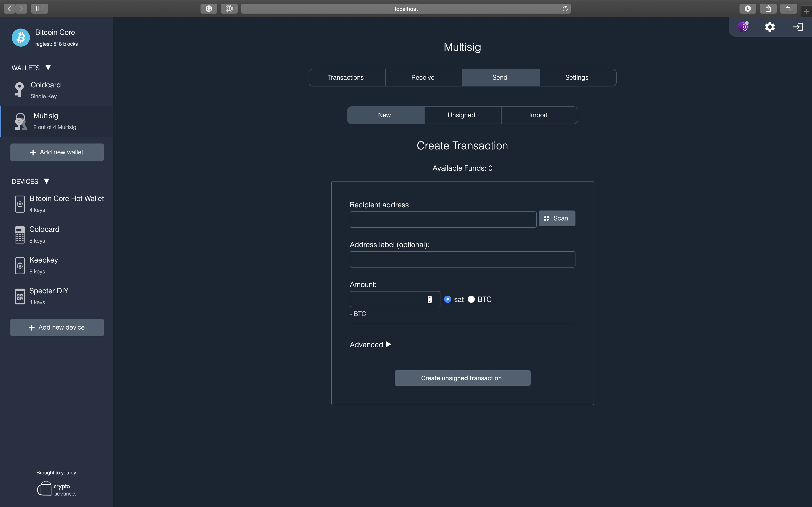
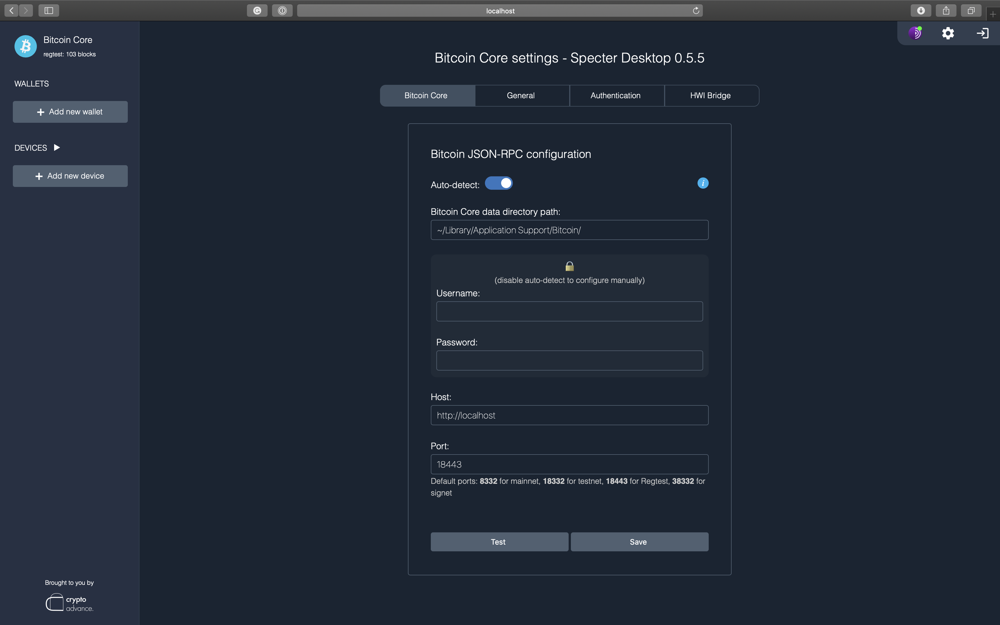

<!-- START doctoc generated TOC please keep comment here to allow auto update -->
<!-- DON'T EDIT THIS SECTION, INSTEAD RE-RUN doctoc TO UPDATE -->
**Table of Contents**

- [Specter Desktop](#specter-desktop)
  - [DISCLAIMER](#disclaimer)
  - [Video Walkthrough](#video-walkthrough)
  - [Why?](#why)
  - [Help wanted: Do you like Specter?](#help-wanted-do-you-like-specter)
  - [How to run](#how-to-run)
    - [Using the Specter Desktop app](#using-the-specter-desktop-app)
    - [Installing Specter from Pip](#installing-specter-from-pip)
    - [Connect Specter to Bitcoin Core](#connect-specter-to-bitcoin-core)
  - [Tips and tricks (detailed instructions)](#tips-and-tricks-detailed-instructions)
  - [Errors, doubts.. Read our FAQ!](#errors-doubts-read-our-faq)
  - [A few screenshots](#a-few-screenshots)
    - [Adding a new device](#adding-a-new-device)
    - [Creating a new wallet](#creating-a-new-wallet)
    - [Wallet interface](#wallet-interface)
    - [Configuration](#configuration)

<!-- END doctoc generated TOC please keep comment here to allow auto update -->

# Specter Desktop

    "A specter is haunting the modern world, the specter of crypto anarchy."
    The Crypto Anarchist Manifesto - Timothy C. May - Sun, 22 Nov 92 12:11:24 PST

[](https://cirrus-ci.com/github/cryptoadvance/specter-desktop)
[](https://donate.specter.solutions/apps/3k77BAT6zshCGNd3i7gw9WKwXQy1/pos)

## DISCLAIMER

This software might be ready to be used but at your own risk.

If something doesn't work open an issue here or ask a question in our [Telegram group](https://t.me/spectersupport).

## Video Walkthrough
 [Watch here](https://www.youtube.com/watch?v=v3SEp0SkOWs)

## Why?

Bitcoin Core has a very powerful command line interface and a wonderful daemon. Using PSBT and [HWI](https://github.com/bitcoin-core/HWI) it can also work with hardware wallets, but at the moment it is too linux-way. The same applies to multisignature setups. 

The goal of this project is to make a convenient and user-friendly GUI around Bitcoin Core with a focus on multisignature setup with hardware wallets and airgapped devices.

At the moment Specter-Desktop is working with all major hardware wallets including:
- Trezor
- Ledger
- KeepKey
- BitBox02
- ColdCard (optionally airgapped, using an SD card)
- Electrum (optionally airgapped, if running Electrum on an airgapped computer/ phone)
- Specter DIY (optionally airgapped, using QR codes)
- Cobo (airgapped, using QR codes)

We also support using the Bitcoin Core as a hot wallet, by importing or generating a random BIP39 mnemonic, but this feature is experimental and we do not recommend using it at this stage.
We plan to add support for other hardware wallets as they come up. If you are interested in using Specter with a hardware wallet currently unsupported, let us know by opening an issue here or asking in our [Telegram group](https://t.me/spectersupport).

## Help wanted: Do you like Specter?
Please help us to push forward, fix bugs, refine FAQs and please help each other in the support channel.
As a small team on a tiny budget we are working hard to make Specter better every day – for Bitcoin, for you and for us.
We are quite overwhelmed with the response, the guides and shout-outs. Thank you!
Stepan, Ben, Kim, all the fellow Specter-Builders & Moritz

[Donations are welcome](https://donate.specter.solutions/apps/3k77BAT6zshCGNd3i7gw9WKwXQy1/pos)

## How to run

### Using the Specter Desktop app
The easiest way to run Specter Desktop is by installing the Specter Desktop app, which you can find on the [GitHub release page](https://github.com/cryptoadvance/specter-desktop/releases).
With this method, all you need to do is just download the right file for your operating system and install it like a normal desktop app (Debian buster is only [partially supported](https://github.com/cryptoadvance/specter-desktop/issues/769))

### Installing Specter from Pip
* Specter requires Python version 3.6 to 3.8. We will support python 3.9 when HWI adds support for it.
* Bitcoin Core node should be at least v0.19+, better if it's the latest one from [bitcoincore.org](https://bitcoincore.org/en/download/).
* HWI support requires `libusb` 
  * Ubuntu/Debian: `sudo apt install libusb-1.0-0-dev libudev-dev python3-dev`
  * macOS: `brew install libusb`
  * Windows: follow instructions in [`windows.md`](docs/windows.md)
  * Arch: `sudo pacman -Syu && sudo pacman -S libusb`
  * Fedora/CentOS: `sudo yum -y install libusb libudev-devel python3-devel`
 * Install Specter
```sh
pip3 install cryptoadvance.specter
```
* Run Specter
```sh
python3 -m cryptoadvance.specter server 
```
* Upgrade Specter
```sh
pip3 install cryptoadvance.specter --upgrade
```

After that, Specter will be available at [http://127.0.0.1:25441/](http://127.0.0.1:25441/).

The above installation-method is quite easy but you have to trust pypi. If you want to verify the software completely yourself while still installing via pip3, you can do something like this (adjust yourself for other versions):
```
wget https://github.com/cryptoadvance/specter-desktop/releases/download/v1.7.0/cryptoadvance.specter-1.7.0.tar.gz
wget https://github.com/cryptoadvance/specter-desktop/releases/download/v1.7.0/SHA256SUMS
sha256sum --ignore-missing --check SHA256SUMS
wget https://github.com/cryptoadvance/specter-desktop/releases/download/v1.7.0/SHA256SUMS.asc
gpg --verify SHA256SUMS.asc
# Now, let's extract the requirements-file and install all requirements with require-hashes
tar -xvzf cryptoadvance.specter-1.7.0.tar.gz cryptoadvance.specter-1.7.0/requirements.txt
# create your ususal virtualenv
virtualenv --python=python3 .env
# activate
pip3 install -r cryptoadvance.specter-1.7.0/requirements.txt --require-hashes --upgrade
# The package cryptoadvance.specter itself cannot be included into requirements.txt
# But we have checked the checksum before so it's safe to install without checking it's hash
pip3 install cryptoadvance.specter-1.7.0.tar.gz
```


You can also run it using Tor, provide SSL certificates to run over https. Https is especially important because browsers don't allow the website to access the camera without secure connection, and we need camera access to scan QR codes.

An example how to run Specter server with SSL certificates (`--key`, `--cert`) over Tor (make sure to walk through the [Tor-document](docs/tor.md) ):

```sh
python3 -m cryptoadvance.specter server --tor --cert=./cert.pem --key=./key.pem
```

### Connect Specter to Bitcoin Core

If your Bitcoin Core is using a default data folder the app should detect it automatically. If not, consider setting `rpcuser` and `rpcpassword` in the `bitcoin.conf` file or set in directly in the specter-app settings. 

If you are using Bitcoin Core with GUI, set `server=1` in `bitcoin.conf`. This setting allows other programs to talk to the rpc server of Bitcoin Core. It's automatically enabled when you are using bitcoind, but disabled in bitcoin-qt.

If you use Specter from a remote machine and want to use it with hardware wallets connected via USB, please read [this guide on setting up HWIBridge](docs/hwibridge.md) to facilitate such connection to hardware wallets. 

Have a look at [development.md](docs/development.md) for further information about hacking on Specter-desktop.

## Tips and tricks (detailed instructions)

- Setting up Specter over Tor: [docs/tor.md](docs/tor.md)
- Using self-signed certificates in local network or Tor: [docs/self-signed-certificates.md](docs/self-signed-certificates.md)
- Running Specter as a service on a linux machine: [docs/daemon.md](docs/daemon.md)
- Beyond local network - how to forward your node through a cheap VPS: [docs/reverse-proxy.md](docs/reverse-proxy.md)

## Errors, doubts.. Read our FAQ!

If you're stuck while installing/configuring Specter or you're looking for more informations about the project, read our [FAQ](docs/faq.md)!

## A few screenshots

### Adding a new device





### Creating a new wallet





### Wallet interface







### Configuration


