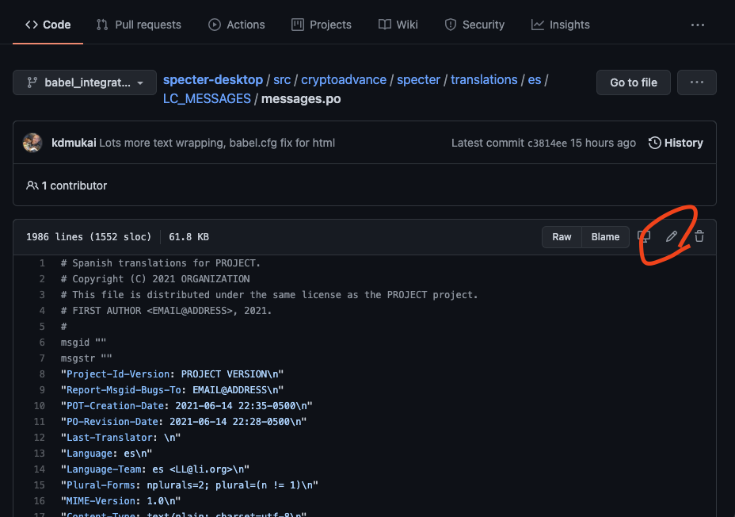

# Babel multi-language support


## For Translators
Many of you translator volunteers will be new to git/github so we'll start with the basics:


### Create github account, install Github Desktop
Install the [Github Desktop app](https://desktop.github.com/). This is an easy way to manage your changes to an open source project.

When Github Desktop starts up it'll ask you to log in to your github account. If you don't already have an account, create one now.


### Clone the Specter Desktop repo
Now you're going to grab a copy of the full Specter Desktop source code, which includes the translation files.

Open the Github Desktop app and add the Specter Desktop repo via "Clone a Repository". On the "URL" tab type in "cryptoadvance/specter-desktop":


Select where you want to save the source code on your local computer and hit "Clone".

When you're presented with the following choice, select "For my own purposes":


_When the clone is finished, click on the "Current Branch" button at the top middle and change to "origin/babel_integration" to point to my work-in-progress branch_


### Editing a translation file
Before you begin editing, ALWAYS go to Github Desktop and click the "Fetch origin" button at the top right. This pulls down all the latest changes from the repo. We'll all try our best to make sure that only one person is making changes at a time on a given translation file but if a change is submitted ahead of you, "Fetch origin" will grab it and get you in sync. We want to avoid messy conflicts where two or more people have edited the same translation file.

You'll be working with a `messages.po` file for each specific language. This file lists all the text that is displayed in Specter in English as a series of "msgid"s. Your job is to complete the matching translation in the "msgstr" field.

The `messages.po` text format is fairly straightforward but can be a little hard to work with, especially for multi-line phrases. Instead, we recommend that translators use the free tool [Poedit](https://poedit.net/download).

Once it's installed, go to Poedit preferences and uncheck "Wrap at":


Navigate to the directory where you cloned the repo. The translation files can be found organized by two-letter language code (e.g. Spanish = "es") under `src/cryptoadvance/specter/translations`.

In Poedit open the `messages.po` file for your target langage (e.g. Spanish: [src/cryptoadvance/specter/translations/es/LC_MESSAGES/messages.po](../src/cryptoadvance/specter/translations/es/LC_MESSAGES/messages.po)).

Add or update translations, then save your changes.


### Editing Guidelines
* It's okay to leave some lines blank! If you can't provide a proper translation, just skip it and other translators will fill them in later. A blank entry will default to just displaying the original English.

* Some of the text strings have html or other code-related markup within them:
	```
	Please let us know! Create an <a href="https://github.com/cryptoadvance/specter-desktop/issues" target="_blank">issue</a> or ping us on <a href="https://t.me/spectersupport" target="_blank">Telegram</a> to fix it.
	```

	Your translations must preserve all of the html markup. If you are unfamiliar with html markup, feel free to just skip these entries.

* You'll also see passages with markers for where text will be dynamically inserted:
    ```
    "Hello {}, welcome back!"
    ```
    In this example case the user's name will be inserted in the curly brackets. Your translation must preserve the curly brackets.

    This is used in a lot of our error reporting:
    ```
    "Wallet failed to load. {}"    
    ```
    The brackets at the end will display an error code, debugging info, etc.

* Much of the text will include some very technical terms. If you're unfamiliar with the term in English or don't know its equivalent in your target language (e.g. "derivation path" or "hash"), review other occurrences of that word in existing translations in the `messages.po` file or ask in the Telegram group. Obviously we want to try to use the most recognizable, common term in each language, even though there won't necessarily be a standard set.

	And many languages will most likely just keep many of the technical words the same (e.g. "xpub").

* The strings are presented out of context and a word may have many possible translations. If you can't figure out the right usage, ask for help in the Telegram group. Each string includes the exact line number where it was found in the code (right-click on it in Poedit and you'll see "Code Occurrences"). Include this info and others can help you get a better sense of how it's being used in that context. You can also directly review that line of code yourself (click on the entry in "Code Occurrences") but that may be bewildering if you are not a developer.


### Submitting your changes
The updated `messages.po` file should now show up in Github Desktop as having changes. 


_Note: You'll see the app offering to "create a fork". Do not create a fork! We want your local copy of the Specter Desktop code to remain connected to our repo, not a forked version that you'll have to manage._

**_The next steps will break from typical `git` procedures in order to keep things simple for our non-programmer translators._**

In a web browser go to github's latest version of the translation file you were just working on. Remember that the directories are organized by the two-letter language codes. So for Spanish ("es"):
[https://github.com/cryptoadvance/specter-desktop/tree/master/src/cryptoadvance/specter/translations/es/LC_MESSAGES/messages.po](https://github.com/cryptoadvance/specter-desktop/tree/master/src/cryptoadvance/specter/translations/es/LC_MESSAGES/messages.po)

Click on the pencil icon to edit the translation file:



You can now directly edit the file. But we want to use the version you just updated in Poedit.

On your computer, navigate to the `messages.po` file and open it with a simple text editor (macOS: TextEdit; Windows: Notepad). We have to make sure that the text editor doesn't change the file when it opens it (more complex editors might try to reformat the file). Copy the entire contents of the file.

Back in your browser, delete all the content in the editing window (click into the editing area and CTRL-A to select all, then delete), then paste your latest text into the online editing window.

If everything went correctly, you should just see your edits when you click the "Preview changes" tab just above the online editing window.


Any changed lines will be highlighted. Red highlights are deletions, green are additions.

Scroll to the bottom of that web page to the "Commit changes section". If your update addresses a specific issue that was raised in the repo's "Issues" section, reference it by number in the optional extended description box using this format: "Fixes #1234" (using the actual issue number, obv). 

Select the option to "Create a new branch" and then click "Propose changes":


Then on the next screen follow the prompts to create your pull request and submit it to the project.

A reviewer on the Specter Desktop team will review your changes and (hopefully) accept the changes. Your contributions will be merged into the main Specter Desktop code repository. You will officially be a Specter Desktop open source contributor!


## For Developers:
### "Wrapping" text for translation
All you have to do in your code is wrap each piece of English text with the `ugettext` shorthand `_()`:
* Wrap jinja template text: `<p>Hello, world!</p>` becomes `<p>{{ _('Hello, world!') }}</p>`
* Wrap python strings: `error="No device was selected."` becomes `error=_("No device was selected.")`
* Use `.format()` to wrap strings with variable injections:
    ```
    mystr = f"My dad's name is {dad.name} and my name is {self.name}."
    mystr = _("My dad's name is {} and my name is {}").format(dad.name, self.name)
    ```

    If there are a lot of variables to inject, placeholder names can be used:
    ```
    mystr = _("My dad's name is {dad_name} and my name is {my_name}").format(dad_name=dad.name, my_name=self.name)
    ```


### Rescanning for text that needs translations
Re-generate the `messages.pot` file:
```
pybabel extract -F babel/babel.cfg -o babel/messages.pot .
```
This will rescan all wrapped text, picking up new strings as well as updating existings strings that have been edited.

Then run `update`:
```
pybabel update -N --no-wrap -i babel/messages.pot -d src/cryptoadvance/specter/translations

# Or target a specific language code:
pybabel update -N --no-wrap -i babel/messages.pot -d src/cryptoadvance/specter/translations -l es
```
_note: the `-N` flag prevents babel from trying to use fuzzy matching to re-use existing translations for new strings. The fuzzy matching does not seem to do what we would want so we keep it disabled._

Any newly wrapped text strings will be added to each `messages.po` file. Altered strings will be flagged as needing review to see if the existing translations can still be used.

Once the next round of translations is complete, recompile the results:
```
pybabel compile -d src/cryptoadvance/specter/translations

# Or target a specific language code:
pybabel compile -d src/cryptoadvance/specter/translations -l es
```


### Adding support for another language
Assuming you have `extract`ed an updated `messages.pot`, all you have to do is generate the initial version of each new language file:
```
pybabel init -i babel/messages.pot -d src/cryptoadvance/specter/translations -l es
pybabel init -i babel/messages.pot -d src/cryptoadvance/specter/translations -l fr
pybabel init -i babel/messages.pot -d src/cryptoadvance/specter/translations -l de
```

Then `update` and `compile` as above.

The only other step is to add the new language to the LANGUAGES list in `config.py`; the UI droplist automatically populates from that list. By convention use the native way to present the language:
```
# wrong:
    "he": "Hebrew",

# right:
    "he": "עברית",
```

## For Packagers:
The mo-files are not checked into the repository as (large) binary (large) objects ("BLOBs") should not be checked into git to reduce repo-size bloat. So effectively they need to be generated before the user is using the software. Effectively what has been described above:

```
pybabel compile -d src/cryptoadvance/specter/translations
```

In order to make that as transparent as possible, that procedure has been integrated into the setup-process. So it will be executed by:

```
python3 setup.py install
```

Unfortunately, it won't be executed by `pip3 install -e .` even though that has been propagated very long to be the developement-env installation procedure. So in the various installation procedures (mainly in `.gitlab-ci.yml`) this has been changed. For more special packaging mechanism, this needs to be respected as well.