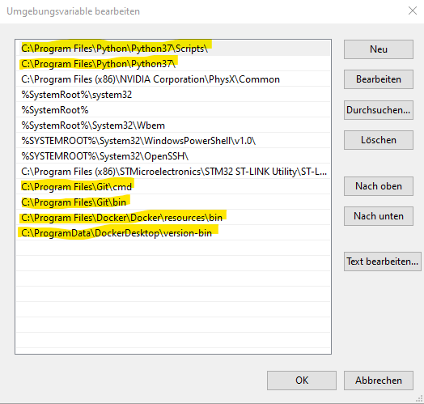

# introduction
specter-desktop is using gitlab and Travis-CI for continuous integration purposes. Both have advantages and disadvantages so ... let's use both!
Gitlab:
* is completely open Source for server- and clients
* the gitlab-runner can run docker and is itself running on docker
* but does not support Pull-Requests
* needs to have bitcoind in a prepared docker-container which binds the build to that version

Travis-CI:
* supports the PR-model
* quite easy to setup even without docker
* enables to test against any specific version of bitcoind we would like to

# Gitlab

Gitlab is a great CI/CD-platform and in the meantime it's quite easy to use it for github-repositories.
https://docs.gitlab.com/ee/ci/ci_cd_for_external_repos/github_integration.html
The main file which specifies the jobs on gitlab is .gitlab-ci.yml
We're using a gitlab-docker-runner which means that all jobs are running in a container.
However at the same time we're using docker to spinup a bitcoind. 

The image is created manually (see /docker) and used for running the tests AND also for 
spinning up bitcoind.

For that reason we need to share the docker-socket from the host into the container and 
create our own gitlab specific runner as described here: 
https://docs.gitlab.com/ee/ci/docker/using_docker_build.html#use-docker-socket-binding

Due to that setup there are some specifics which are mainly addressed in tests/conftest 
start_bitcoind-function:
* some pytest specific stuff to enable "pytest --docker" (used in .gitlab-ci.yml)
* adding -rpcallowip= (from a docker network) to bitcoind
* not use localhost but the docker-network-ip-address when talking to the bitcoind

# Travis-CI

Travis-CI setup is very straightforward. As we're using the build-cache, the bitcoind sources and build is cached. Therefore such a build would only take 2 minutes. If the master-branch has new commits, bitcoind gets automatically rebuilt and the tests are running against the new version (tests/install_bitcoind.sh).py

# Releasing

## What gets releases

We're mostly releasing automatically. Currently the following artifacts are releases:
* specterd (aemon) is a binary for kicking off the specter-desktop service on the commandline. We have binaries for windows, linux and macos
* We have an Electron-App which we're also releasing for windows, linux and macos. Unfortunately the macOS build is not yet automated
* We release a pip-package
* We release docker-images, these are also not yet automated

# How we release
As we have a strict build-only-on-private-hardware build-policy, we're using gitlab private runners in order to build our releases. In order to test and develop the releasing automation, people can setup gitlab-projects which are syncing from their github-forks. With such a setup it's possible to create test-releases and therefore test the whole procedure end-to-end.

The automation of that kicks in if someone creates a tag which is named like "vX.Y.Z". This is specified in the gitlab-ci.yml. The release-job will only be triggered in cases of tags. One step will also check that the tag follows the convention above.
The package upload will need a token. How to obtain the token is described in the packaging-tutorial. It's injected via gitlab-variables. ToDo: put the token on a trusted build-node.

The alternative would have been to use travis-ci for releasing. In that case we would encrypt the token with a private-key from travis and commit to the repo. This looks more safe to me then the above scenario but less safe then the todo, where we're storing the token on the build-node.

## pyinstaller system-dependent binaries
The [pyinstaller directory](../pyinstaller) contains scripts to create the platform-specific binaries (plus electron) to use specter-desktop as a desktop-software. Some of them are created and uploaded to [github-releases](https://github.com/cryptoadvance/specter-desktop/releases) via more or less special build-agents.
The [windows-build-agent](https://docs.gitlab.com/runner/install/windows.html) needs manual installation 
of git, python and docker. Docker is used to build the innosetup-file.
As docker is available in windows only as a "desktop-edition", one need to also
log into the windows-machine to get docker started.
Clearly there is an opportunity to move all of the creation of the windows-binary to wine on docker,
similiar to the way the innosetup is running within docker.

# CI/CD-dev-env setup

Here is a brief description on how to create a setup where the release-procedures can be tested:
* We assume you have a fork of cryptoadvance/specter-desktop. We also assume that your gitlab-user-handle is the exact same then on github.
* Create a gitlab-account and then a mirroring project ([here](https://gitlab.com/projects/new#cicd_for_external_repo)) obviously with the exact same name: "specter-desktop"
* Activate the private runners and deactivate the public runners. Contact @k9ert for that.
* Create an account and an [API token](https://test.pypi.org/manage/account/) on there
* Create a token for github in order to release to your github-fork
* Configure both tokens on the gitlab-variables (GH_BIN_UPLOAD_PW and TWINE_PASSWORD)
* create a tag on your github-fork
* watch the test-release unfolding, ready to hack

# Gitlab-runner setup (Windows)

For Windows-releasing, we're using a windows gitlab-runner. Here is a short description on how to set one up.

## Prerequisites

You need at least Windows Home 10 which is up-to-date. The most complex dependecy is setting up docker.
Docker-Desktop needs a WSL2 which is a good idea to install on windows anyway. [Here](https://www.omgubuntu.co.uk/how-to-install-wsl2-on-windows-10) is a description on how to do that.

While installing, make sure you know the locations of where that stuff is installed. We'll later need to verify/adjust the PATH.

* Install Python, i took the [3.7.9 webinstaller](https://www.python.org/ftp/python/3.7.9/python-3.7.9-amd64-webinstall.exe)
* Install Git, e.g. [this](https://github.com/git-for-windows/git/releases/download/v2.29.2.windows.2/Git-2.29.2.2-64-bit.exe) (i had 2.28.2)
* Install [Docker-Desktop](https://desktop.docker.com/win/stable/Docker%20Desktop%20Installer.exe)

Now open and check the "Environment-variables" and check that the following lines are in there:

## Runner

The runner itself is easy to [setup](https://docs.gitlab.com/runner/install/windows.html). Follow the link or this very brief description:
*  `mkdir \Gitlab-Runner`
* download [this binary](https://gitlab-runner-downloads.s3.amazonaws.com/latest/binaries/gitlab-runner-windows-amd64.exe) in that folder and rename to gitlab-runner.exe
* Search for "powershell" in windows an open AS ADMINISTRATOR
* `cd \Gitlab-Runner`
* Copy the Registration-token from [here](https://gitlab.com/k9ert/specter-desktop/-/settings/ci_cd) (unfold runners, see specific runners)
* `./gitlab-runner.exe register`and paste the token (the instance-url is the default)
* give a reasonable description. Make sure to tag this runner with "tag". If that's not possible here, you can do it in the page mentioned above
* `.\gitlab-runner.exe install` will install the runner as system-service
* `.\gitlab-runner.exe start` will start it

Done