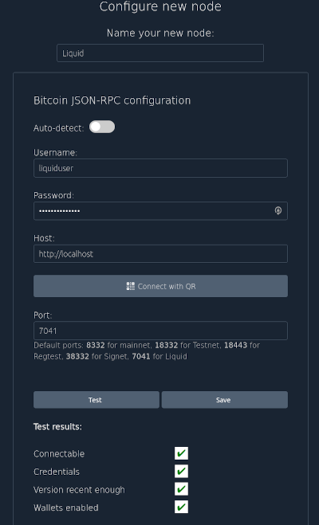
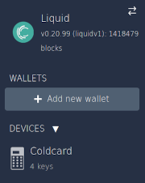
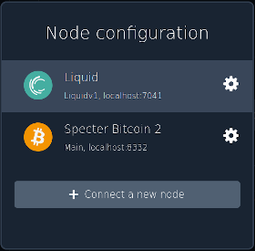
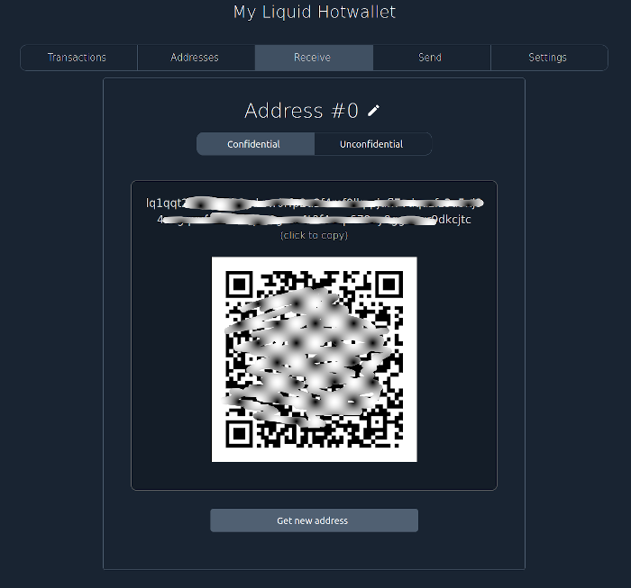
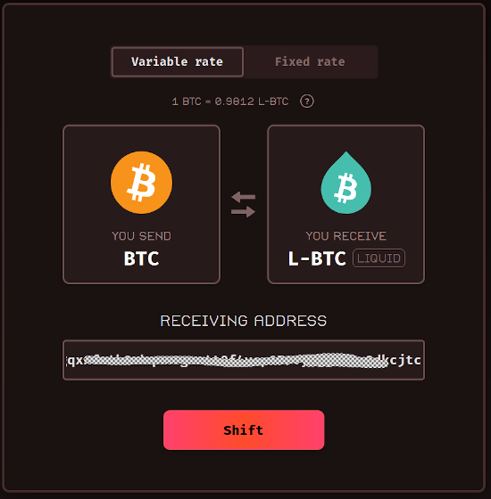
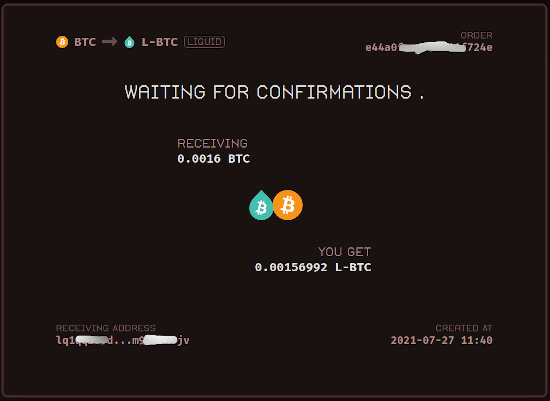
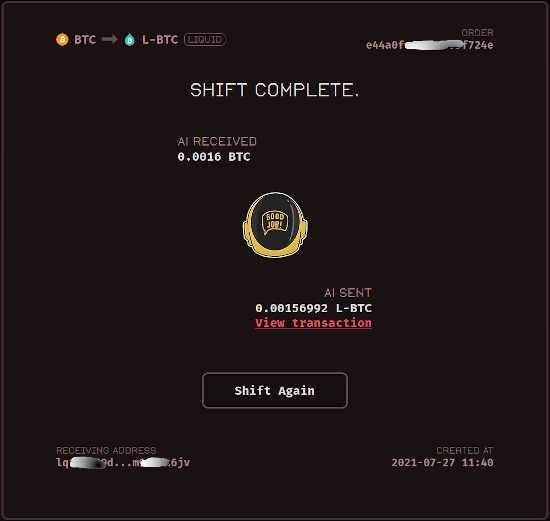
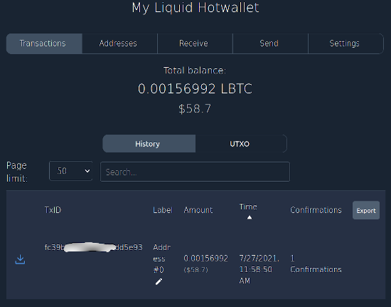

# Elements/Liquid Support
Since `v1.5.0`, Specter-Desktop has basic Elements/Liquid Support. You can run/connect your own elements/liquid-node, you can create Liquid-Hotwallets and even combine them to multisig-wallets. Multisig with three hotwallets is indeed not that useful, but it's a start. We're planning to also support different assets (and might even have that already) and also support for Jade and specter-DIY.

This document is a description on how to get started with elements/liquid. We'll first go into the details of setting up the node, mostly referring to external documents. 

After that, we'll explain how to connect your Specter Desktop to that node, create wallets and receive some coins (via sideshift.ai). Signing transactions is nowhere different than in any other Hotwallet.

## Elements Installation
The Elements's instalaation is highly dependent to your system. Choose a fitting [artifact](https://github.com/ElementsProject/elements/releases) and install them. 

## Liquid Node
In order to validate Peg-Ins, you'll need RPC-access to your Bitcoin-Core node. I did this with a fullnode, it might also work with a pruned node (not tested, though).

First, we need to create the `elements.conf` file which is located in the `datadir`. If you don't specify the datadir at startup, the standard-directory is `<homefolder>/.elements/elements.conf`. Here is an example:

```
chain=liquidv1
mainchainrpchost=localhost
mainchainrpcport=8332
mainchainrpcuser=your-username
mainchainrpcpassword=your-user-password

rpcuser=liquiduser
rpcpassword=liquidpassword
```

We assume here, that you're running the liquid node on the same machine than the core-node, therefore `localhost`. Get the values for `mainchainrpcuser` and `mainchainrpcpassword` from your `bitcoin.conf`. You can choose `rpcuser` and `rpcpassword` as you like. You'll later need that in specter, to configure access to the elements-node, similiar than to the core-node.

After that, let's start the `elements-node`. We'll start it simply via the commandline in an extra-terminal. Transforming that to a proper service is beyond the scope of this tutorial.

```
tests/elements/src/elements/elementsd
```

A successfull startup will result in validating the blocks. Currently the blockheight for liquid is at about 1417550. So if it's running as expected, you should see blocks validating, lots of messages like this:

```
2021-07-26T15:31:09Z UpdateTip: new best=cbf3ce54912825928d51c8e49eb86a310b53d98c61da560bd9e95ee62e019cd0 height=1502 version=0x20000000 tx=1512 date='2018-09-28T10:38:59Z' progress=0.002000 cache=0.0MiB(13txo)
```

It took about 12 hours for a full-sync in my case on a Intel Quadcore Gen 6 3.50GHz.

## Liquid Configuration in Specter

You're probably familiar with this part. On the upper-left, click on the `two arrows -> connect a new node -> Connect existing node`. Here is a screenshots with the values fitting to the configuration above:



After clicking on `save`, the node will get selected. You see something like this in the upper left:



As you can your wallets disappeared but your devices did not. The shown wallets are now specific to the Node which has been selected. The node can be switched via the clicking on the two arrows.



## Hotwallet-Creation

The process of creating a Liquid Hotwallet is very similiar to creating a Bitcoin-Core Hotwallet. First you need to create a Hotwallet-Device `Add new device -> Elements Core (hot wallet) -> Continue -> Enter Name -> Continue` (Don't forget to note the seed).
After that, you can directly create a single key wallet: `Create single key wallet -> Enter Name -> Create Wallet`. You can download the usual Backup Pdf.

So if you now get a receive-address, you have to choose between a Confidential and a Unconfidential address.



## Fund the wallet

There are many ways you can fund your wallet. Let's assume you have Bitcoin and want to receive LiquidBtc (LBTC). At [https://sideswap.io/peg-in-out/](https://sideswap.io/peg-in-out/) you can Peg-In some Btc as a service. At [https://sideshift.ai/](https://sideshift.ai/) you can [https://sideshift.ai/btc/liquid](swap) BTC agains LBTC (and [vice versa](https://sideshift.ai/liquid/btc)).

As an example, let'S choose sideshift.ai to swap some BTC to LBTC.

    



### Advanced stuff: Elements Compilation

## Elements Compilation

Since `v1.7.0`, It's no longer needed to compile Elements yourself as Specter is now working with Elements [0.21.0](https://github.com/ElementsProject/elements/releases/tag/elements-0.21.0).
However, maybe you want to compile it for some reason, so here is a quick guide on how to do that.
You'll need to checkout the master-branch. If you want to be very sure that the integration with Specter works, you should checkout the exact commit which specter uses when doing automatic testing. You can see that commit in this [file](../tests/elements_gitrev_pinned) (currently `elements-0.21.0`).

You can checkout elements wherever you want as long as the `elementsd` and `elements-cli` will be available on the path or in the `tests/elements/src` folder. We assume here, you'll do the latter. If you have a ubuntu/debian-based linux, please check the easier way below before manually checking out:

```sh
cd tests
git clone https://github.com/ElementsProject/elements.git
cd elements
git checkout 1ba24fe9b3cc3ad1166ed93a0969602d0c7898ff # Use the commit from the file above
```

The rest is very system-specific and we're referring here to the documentation in liquid:
* [free-](https://github.com/ElementsProject/elements/blob/elements-0.18.1.12/doc/build-freebsd.md)/[net-](https://github.com/ElementsProject/elements/blob/elements-0.18.1.12/doc/build-netbsd.md)/[open-](https://github.com/ElementsProject/elements/blob/elements-0.18.1.12/doc/build-openbsd.md)BSD
* [OsX](https://github.com/ElementsProject/elements/blob/elements-0.18.1.12/doc/build-osx.md)
* [Unix/Linux](https://github.com/ElementsProject/elements/blob/elements-0.18.1.12/doc/build-unix.md)
* [Windows](https://github.com/ElementsProject/elements/blob/elements-0.18.1.12/doc/build-windows.md)

If you're running a Debian/Ubuntu-based Linux-System, you can most probably use the script which we're using internally to setup our test-system. This will include the clone/checkout above. So simply start, from the root-folder of the project:

```sh
./tests/install_noded.sh --elements compile
```

Make sure that this is successfull by checking these two files to be existent:

```sh
ls tests/elements/src/elements-cli tests/elements/src/elementsd
tests/elements/src/elements-cli  tests/elements/src/elementsd
```