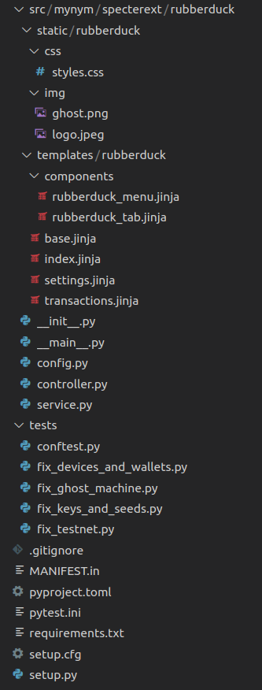

# Extensions

A developer's guide for the Specter Desktop `Extension` framework. 

We currently rework the naming of extensions/plugins/services. If not otherwise stated, you can see those three terms as the same, for now.

## TL;DR

You can create an extension with an up to date Specter Desktop instance as simple as this:
```
$ pip3 install cryptoadvance.specter --upgrade
$ mkdir /tmp/rubberduck && cd /tmp/rubberduck
$ python3 -m cryptoadvance.specter ext gen
                                
            We need an id and a prefix for your extension.
            The id should be a short string.
            The prefix is usually your GitHub username 
            or GitHub organisation name. 
            Both will be used to to create a directory structure like this:
                ./src/mycorpname/specterext/myextension
            They will also be used when publishing this extension to pypi.

Enter the id of your extension (lowercase only): rubberduck
Enter the prefix: mynym

            Note: Isolated client mode means that the extensions won't share the session cookie with 
            Specter Desktop and the integration only happens on the server side.
        
Should the extension work in isolated client mode (y/n)?: n
    --> Created requirements.txt
    --> Created .gitignore
    --> Created src/mynym/specterext/rubberduck/service.py
    --> Created src/mynym/specterext/rubberduck/controller.py
    --> Created src/mynym/specterext/rubberduck/config.py
    --> Created src/mynym/specterext/rubberduck/__init__.py
    --> Created src/mynym/specterext/rubberduck/__main__.py
    --> Created src/mynym/specterext/rubberduck/templates/rubberduck/index.jinja
    --> Created src/mynym/specterext/rubberduck/static/rubberduck/css/styles.css
    --> Created src/mynym/specterext/rubberduck/static/rubberduck/img/ghost.png (via Github)
    --> Created src/mynym/specterext/rubberduck/static/rubberduck/img/logo.jpeg (via Github)
    --> Created src/mynym/specterext/rubberduck/templates/rubberduck/base.jinja
    --> Created src/mynym/specterext/rubberduck/templates/rubberduck/transactions.jinja
    --> Created src/mynym/specterext/rubberduck/templates/rubberduck/settings.jinja
    --> Created src/mynym/specterext/rubberduck/templates/rubberduck/components/rubberduck_menu.jinja
    --> Created src/mynym/specterext/rubberduck/templates/rubberduck/components/rubberduck_tab.jinja
    --> Created pytest.ini
    --> Created tests/conftest.py
    --> Created tests/fix_ghost_machine.py
    --> Created tests/fix_devices_and_wallets.py
    --> Created tests/fix_testnet.py
    --> Created tests/fix_keys_and_seeds.py
    --> Created pyproject.toml
    --> Created setup.py
    --> Created setup.cfg
    --> Created MANIFEST.in

        Congratulations, you've created a new extension!

        Here is how to get it to run in your development environment:
            pip3 install -e .
            python3 -m cryptoadvance.specter server --config DevelopmentConfig --debug
            # Point your browser to http://localhost:25441
            # Click "Choose plugins" --> rubberduck

        If you want to package it, you can build it like this:
            python3 -m pip install --upgrade build
            python3 -m build
            # Install it like this:
            pip3 install dist/mynym_rubberduck-0.0.1-py3-none-any.whl

        If you want to bring your extension to production, please refer to 
        the readme in the dummy-extension repo:
        https://github.com/cryptoadvance/specterext-dummy#how-to-get-this-to-production
    
        To publish your package

            python3 -m pip install --upgrade twine
            python3 -m twine upload --repository testpypi dist/*

        You can get all this information again via:
        python3 -m cryptoadvance.specter ext gen --help
$ 
```
The created file structure looks like this and you will feel right at home if you have some knowledge about how Flask works:





## Concept
As much as possible, each `extension` should be entirely self-contained with little or no custom code altering core Specter functionality. There is a name for that: Extension framework.
The term `extension` will be used for all sorts of extensions whereas `plugin` will be used as a component which can be de-/activated by a user.

All extensions are completely seperated in a specific folder structure. There are internal extensions which SHOULD be located in `cryptoadvance.specterext.id_of_extension` but at least 2 extensions are still at the deprecated location of `cryptoadvance.specter.services`. However, that does not mean that an extension needs to be located in the same repository as Specter itself. Extensions can be located in their own repository even if they are incorporated into the official Specter release.

Independent of whether an extension is shipped with the official Specter-release binaries and whether it's an internal (which is shipped) or external extension (which might be shipped), the creation of extensions is already heavily supported and encouraged.
Whether an extension is shipped with the official binary is ultimately a choice of the Specter team. However, you can simply develop extensions and use them on production (only for technical personel) as described in `specterext-dummy` (see below).

A description of how to create your own extension can be found above.

All the attributes of an extension are currently (json support is planned) defined as attributes of a class which is derived from the class `Service` (should be renamed). That class has attributes which are essential. So let's discuss them briefly.

## Extension attributes
Here is an example. This class definition MUST be stored in a file called "service.py" within a package with the name `org-id.specterext.extension-id`.
```
class DiceService(Service):
    id = "dice"
    name = "Specter Dice"
    icon = "dice/dice_logo.png"
    logo = "dice/dice_logo.png"
    desc = "Send your bet!"
    has_blueprint = True
    blueprint_module = "k9ert.specterext.dice.controller"
    isolated_client = False
    devstatus = devstatus_alpha
```
This defines the base `Service` class (to be renamed to "Extension") that all extensions must inherit from. This also enables `extension` auto-discovery. Any feature that is common to most or all `Service` integrations should be implemented here.
With inheriting from `Service` you get some usefull methods explained later.

The `id` needs to be unique within a specific specter-instance where this extension is part of. The `name` is the displayname as shown to the user in the plugin-area (currently there is not yet a technical difference between extensions and plugins). The `icon` will be used where labels are used to be diplayed if this extension is reserving addresses. The `logo` and the `desc`ription is also used in the plugin-area ("choose plugins").
If the extension has a UI (currently all of them have one), `has_blueprint` is True. `The blueprint_module` is referencing the controller module where endpoints are defined. It's recommended to follow the format `org.specterext.extension-id.controller`.
`isolated_client` should not be used yet. It is determining where in the url-path tree the blueprint will be mounted. This might have an impact on whether the extension's frontend client has access to the cookie used in Specter. Check `config.py` for details.
`devstatus` is one of `devstatus_alpha`, `devstatus_beta` or `devstatus_prod` defined in `cryptoadvance.specter.services.service`. Each Specter instance will have a config variable  called `SERVICES_DEVSTATUS_THRESHOLD` (prod in Production and alpha in Development) and depending on that, the plugin will be available to the user.

## Frontend aspects

As stated, you can have your own frontend with a blueprint. If you only have one, it needs to have a `/` route in order to be linkable from the `choose your plugin` page. 
If you create your extension with a blueprint, it'll also create a controller for you which, simplified, looks like this:
```
rubberduck_endpoint = ScratchpadService.blueprint

def ext() -> ScratchpadService:
    ''' convenience for getting the extension-object'''
    return app.specter.ext["rubberduck"]

def specter() -> Specter:
    ''' convenience for getting the specter-object'''
    return app.specter


@rubberduck.route("/")
@login_required
@user_secret_decrypted_required
def index():
    return render_template(
        "rubberduck/index.jinja",
    )
[...]
```
 But you can also have more than one blueprint. Define them like this in your service class:
```
    blueprint_modules = { 
        "default" : "mynym.specterext.rubberduck.controller",
        "ui" : "mynym.specterext.rubberduck.controller_ui"
    }
```
You have to have a default blueprint which has the above mentioned index page.
In your controller, the endpoint needs to be specified like this:
```
ui = RubberduckService.blueprints["ui"]
```

You might have an extension which wants to inject e.g. javascript code into each and every page of specter-desktop. The extension needs to be activated for the user, though. You can do that via overwriting one of the `inject_in_basejinja_*` methods in your service-class:
```
    @classmethod
    def inject_in_basejinja_head(cls):
        ''' e.g. rendering some snippet '''
        return render_template("devhelp/html_inject_in_basejinja_head.jinja")

    @classmethod
    def inject_in_basejinja_body_top(cls):
        ''' or directly returning text '''
        return "<script>console.log('Hello from body top')"

    @classmethod
    def inject_in_basejinja_body_bottom(cls):
        return "something here"
```

## `Address`-Level Integration
An `Address` can be associated with a `Service` (e.g. addr X received a smash buy from `Service` Foo) via the `Address.service_id` field.

A `Service` can also "reserve" an `Address` for future use by setting `Address.service_id`. The normal "Receive" UI will automatically skip any reserved `Address` when generating a new receive address. The reserved addresses are interleaved with ready-to-use addresses so that we don't create any potentially confusing wallet gaps (e.g. addrs 4, 6, and 8 are reserved but addrs 3, 5, and 7 are available).

Users can also manually associate an existing `Address` with a `Service` (this is useful when the user has info that the particular `Service` api can't provide for whatever reason).

_Note: TODO: manually un-reserve an `Address` from a `Service`._

## Data storage
Effort has been taken to provide `Service` data storage that is separate from existing data stores in order to keep those areas clean and simple. Where touchpoints are unavoidable, they are kept to the absolute bare minimum (e.g. `User.services` list in `users.json`, `Address.service_id` field).
As an extension developer, you have the choice to completely manage your own persistence or rely/use one of the two options: You either have data which need encryption (via the passwords of the users) or you don't have that requirement.


### ServiceEncryptedStorage
Some `Services` will require user secrets (e.g. API key and secret). Each Specter `User` will have their own on-disk encrypted `ServiceEncryptedStorage` with filename `<username>_services.json`. Note that the user's secrets for all `Services` will be stored in this one file.

This is built upon the `GenericDataManager` class which supports optional encrypted fields. In this case all fields are encrypted. The `GenericDataManager` encryption can only be unlocked by each `User`'s individual `user_secret` that itself is stored encrypted on-disk; it is decrypted to memory when the `User` logs in.

For this reason `Services` cannot be activated unless the user is signing in with a password-protected account (the default no-password `admin` account will not work).

_Note: During development if the Flask server is restarted or auto-reloads, the user's decrypted `user_secret` will no longer be in memory. The Flask context will still consider the user logged in after restart, but code that relies on having access to the `ServiceEncryptedStorage` will throw an error and/or prompt the user to log in again._

It is up to each `Service` implementation to decide what data is stored; the `ServiceEncryptedStorage` simply takes arbitrary json in and delivers it back out.

This is also where `Service`-wide configuration or other information should be stored, _**even if it is not secret**_ (see above intro about not polluting other existing data stores).

### ServiceEncryptedStorageManager
Because the `ServiceEncryptedStorage` is specific to each individual user, this manager provides convenient access to automatically retrieve the `current_user` from the Flask context and provide the correct user's `ServiceEncryptedStorage`. It is implemented as a `Singleton` which can be retrieved simply by importing the class and calling `get_instance()`.

This simplifies code to just asking for:
```
from .service_encrypted_storage import ServiceEncryptedStorageManager

ServiceEncryptedStorageManager.get_instance().get_current_user_service_data(service_id=some_service_id)
```

As a further convenience, the `Service` base class itself encapsulates `Service`-aware access to this per-`User` encrypted storage:
```
@classmethod
def get_current_user_service_data(cls) -> dict:
    return ServiceEncryptedStorageManager.get_instance().get_current_user_service_data(service_id=cls.id)
```

Whenever possible, external code should not directly access these `Service`-related support classes but rather should ask for them through the `Service` class.

### `ServiceUnencryptedStorage`
A disadvantage of the `ServiceEncryptedStorage` is, that the user needs to be freshly logged in in order to be able to decrypt the secrets. If you want to avoid that login but your extension should still store data on disk, you can use the `ServiceUnencryptedStorage`.

In parallel with the `ServiceEncryptedStorageManager` there is also a `ServiceUnencryptedStorageManager` which is used exactly the same way.

### `ServiceAnnotationsStorage`
Annotations are any address specific or transaction specific data from a `Service` that we might want to present to the user (not yet implemented). Example: a `Service` that integrates with a onchain store would have product/order data associated with a utxo. That additional data could be imported by the `Service` and stored as an annotation. This annotation data could then be displayed to the user when viewing the details for that particular address or tx.

Annotations are stored on a per-wallet and per-`Service` basis as _unencrypted_ on-disk data (filename: `<wallet_alias>_<service>.json`).

_Note: current `Service` implementations have not yet needed this feature so displaying annotations is not yet implemented._

## Data Storage Class Diagram

Unfortunately, the two unencrypted classes are derived from the encrypted one rather than having it the other way around or having abstract classes. This makes the diagram maybe a bit confusing.

[](https://mermaid-js.github.io/mermaid-live-editor/edit#pako:eNqVVMFuwjAM_ZUqJzaVw66IIU0D7bRd0G6VItO4LFvqoCRlqhj_PpeWASLduhyiqH7v-dlOsxO5VSgmIjfg_VzD2kGZUcKr3Z-Q0Ol8DgGegWCNLpl-jcfJEt1W57ig3NWbgGoZrONoS-oJXjBfCaPcPxI-ENkAQVvyF7RHS4VeVw5WBpea1gaDpZbZZ6eT_9VyzMK18_8oZeIuE8l4fMsn4tOQRvZm7FPra24XZgLjK4--38BFTe1-uCORAe3acLOk1KSDlCOPpkgTxSBZWKPQpUlniUcnP7C-f7GENycmQYnSFvLdc7zQBk-hn1r4OxrlTxFjQY3ORKSHbUfcn3vuqTFm_MIyt4h3pX1zraTCA_0sX0b9ya5varxPB7DUKk0-wfC1HSh_PeJdFB7_Mc6sTKf--Hk2G96769lHhJrlW7xc1bJp538qGpQjJnVqhUhFia4ErfiROwhlIrxhiZmY8FFhAZUJmciogVYbHj8ulOb8YlKA8ZgKqIJd1pSLSXAVHkHdW9mh9t9YNMxZ)


### Service configuration
In order to separate the service-configuration from the main-configuration, you can specify your config in a file called `config.py`. It's structure is similiar to the specter-wide `config.py`, e.g.:
```
class BaseConfig():
    SWAN_API_URL="https://dev-api.swanbitcoin.com"

class ProductionConfig(BaseConfig):
    SWAN_API_URL="https://api.swanbitcoin.com"
```
In your code, you can access the correct value as in any other flask-code, like `api_url = app.config.get("SWAN_API_URL")`. If the instance is running a config (e.g. `DevelopmentConfig`) which is not available in your service-specific config (as above), the inheritance-hirarchy from the mainconfig will get traversed and the first hit will get get configured. In this example, it would be `BaseConfig`.
### Callback methods
Your service class will inherit a callback-method which will get called for various reasons with the "reason" being a string as the first parameter. Checkout the `cryptoadvance.specter.services.callbacks` file for the specific callbacks.

Some important one is the `after_serverpy_init_app` which passes a `Scheduler` class which can be used to setup regular tasks. A list of currently implemented callback-methods along with their descriptions are available in [`/src/cryptoadvance/specter/services/callbacks.py`](https://github.com/cryptoadvance/specter-desktop/blob/master/src/cryptoadvance/specter/services/callbacks.py).

### `controller.py`
The minimal url routes for `Service` selection and management. As usualy in Flask, `templates` and `static` resources are in their respective subfolders. Please note that there is an additional directory with the id of the extension which looks redundant at first. This is due to the way blueprints are loading templates and ensures that there are no naming collisions. Maybe at a later stage, this can be used to let plugins override other plugin's templates.

