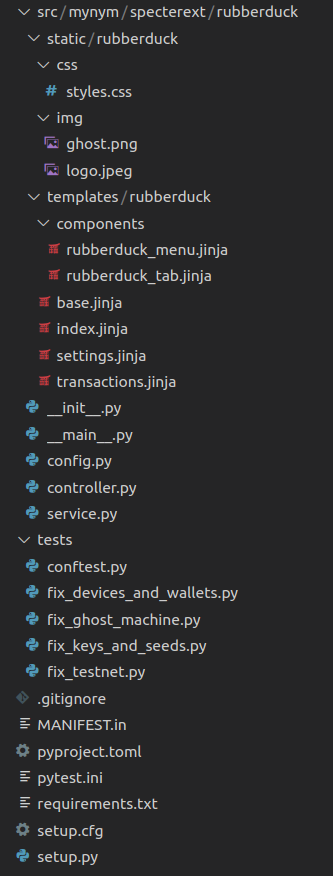

# Introduction

Extensions is a way to extend Specter Desktop in a way which does not need PRs in the core-project. They can be used
to 
- create elaborated Frontends on top of Specter Desktop or even replace the whole Frontend
- Add Additional Menu Items currently in Wallets and Settings
- Create additional Devices with the functionality you would like to have

We currently rework the naming of extensions/plugins/services. If not otherwise stated, for now, they are used interchangeably

## TL;DR

You can create an extension with an up to date Specter Desktop instance. Assuming that we're creating an extension called `rubberduck`, it's as simple as this:
```
$ mkdir /tmp/rubberduck && cd /tmp/rubberduck
$ virtualenv --python=python3 .env
$ . ./.env/bin/activate
$ pip3 install cryptoadvance.specter --upgrade
$ python3 -m cryptoadvance.specter ext gen
                                
            We need an id and a prefix for your extension.
            The id should be a short string.
            The prefix is usually your GitHub username 
            or GitHub organisation name. 
            Both will be used to to create a directory structure like this:
                ./src/mycorpname/specterext/myextension
            They will also be used when publishing this extension to pypi.

Enter the id of your extension (lowercase only): rubberduck
Enter the prefix: mynym

            Note: Isolated client mode means that the extensions won't share the session cookie with 
            Specter Desktop and the integration only happens on the server side.
        
Should the extension work in isolated client mode (y/n)?: n
    --> Created requirements.txt
    --> Created .gitignore
    --> Created src/mynym/specterext/rubberduck/service.py
    --> Created src/mynym/specterext/rubberduck/controller.py
    --> Created src/mynym/specterext/rubberduck/config.py
    --> Created src/mynym/specterext/rubberduck/__init__.py
    --> Created src/mynym/specterext/rubberduck/__main__.py
    --> Created src/mynym/specterext/rubberduck/templates/rubberduck/index.jinja
    --> Created src/mynym/specterext/rubberduck/static/rubberduck/css/styles.css
    --> Created src/mynym/specterext/rubberduck/static/rubberduck/img/ghost.png (via Github)
    --> Created src/mynym/specterext/rubberduck/static/rubberduck/img/logo.jpeg (via Github)
    --> Created src/mynym/specterext/rubberduck/templates/rubberduck/base.jinja
    --> Created src/mynym/specterext/rubberduck/templates/rubberduck/transactions.jinja
    --> Created src/mynym/specterext/rubberduck/templates/rubberduck/settings.jinja
    --> Created src/mynym/specterext/rubberduck/templates/rubberduck/components/rubberduck_menu.jinja
    --> Created src/mynym/specterext/rubberduck/templates/rubberduck/components/rubberduck_tab.jinja
    --> Created pytest.ini
    --> Created tests/conftest.py
    --> Created tests/fix_ghost_machine.py
    --> Created tests/fix_devices_and_wallets.py
    --> Created tests/fix_testnet.py
    --> Created tests/fix_keys_and_seeds.py
    --> Created pyproject.toml
    --> Created setup.py
    --> Created setup.cfg
    --> Created MANIFEST.in

        Congratulations, you've created a new extension!

        Here is how to get it to run in your development environment:
            pip3 install -e .
            python3 -m cryptoadvance.specter server --config DevelopmentConfig --debug
            # Point your browser to http://localhost:25441
            # Click "Choose plugins" --> rubberduck

        If you want to package it, you can build it like this:
            python3 -m pip install --upgrade build
            python3 -m build
            # Install it like this:
            pip3 install dist/mynym_rubberduck-0.0.1-py3-none-any.whl

        If you want to bring your extension to production, please refer to 
        the readme in the dummy-extension repo:
        https://github.com/cryptoadvance/specterext-dummy#how-to-get-this-to-production
    
        To publish your package

            python3 -m pip install --upgrade twine
            python3 -m twine upload --repository testpypi dist/*

        You can get all this information again via:
        python3 -m cryptoadvance.specter ext gen --help
$ 
```
The created file structure looks like this and you will feel right at home if you have some knowledge about how Flask works:




## Virtualenv Management

Often enough, extension development goes hand in hand with the development of Specter Desktop iteself. Especially in the very beginning you need to constantly develop on the extension-concept on Specter Desktop while also using/consuming that functionality in an extension.

In such a case, the current best option is to "reuse" the virtualenv of Specter Desktop also for your extension. Other than what is described above, you would do something like the below. If you have checked out the Specter Desktop Code in parallel with the extension-code, you would ommit the creation of the virtualenv above and rather activate the existing one in your Specter Desktop Development Directory:

```
. ../specter-desktop/.env/bin/activate
pip3 install -e .
python3 -m cryptoadvance.specter server --config DevelopmentConfig --debug
```

Another, maybe even better option, would be to not reuse the Virtual Environment from specter-desktop to install the extension in editable mode, but to do it the other way around: Installing specter-desktop in editable mode in the virtualenv of the extension. However, that needs to be tested.

More information about the development of Specter Desktop can be found [here](../development.md).

## Concept
As much as possible, each `extension` should be entirely self-contained with little or no custom code altering core Specter functionality. There is a name for that: Extension framework.
The term `extension` will be used for all sorts of extensions whereas `plugin` will be used as a component which can be de-/activated by a user.

All extensions are completely separated in a specific folder structure. There are internal extensions which SHOULD be located in `cryptoadvance.specterext.id_of_extension` but at least 2 extensions are still at the deprecated location of `cryptoadvance.specter.services`. However, that does not mean that an extension needs to be located in the same repository as Specter itself. Extensions can be located in their own repository even if they are incorporated into the official Specter release.

Independent of whether an extension is shipped with the official Specter-release binaries and whether it's an internal (which is shipped) or external extension (which might be shipped), the creation of extensions is already heavily supported and encouraged.
Whether an extension is shipped with the official binary is ultimately a choice of the Specter team. However, you can simply develop extensions and use them on production (only for technical personel) as described in `specterext-dummy` (see below).

A description of how to create your own extension can be found above.

All the attributes of an extension are currently (json support is planned) defined as attributes of a class which is derived from the class `Service` (should be renamed). That class has attributes which are essential. So let's discuss them briefly.

## Extension attributes
Here is an example. This class definition MUST be stored in a file called "service.py" within a package with the name `mynym.specterext.myextensionid`. You don't have to create such files yourself. Please always use the extension generation procedure to create your extension.

```python
class MyextensionidService(Service):
    id = "myextensionid"
    name = "A Nice name for my Extension"
    icon = "myextensionid/myextensionid_logo.png"
    logo = "myextensionid/myextensionid_logo.png"
    desc = "A nice description"
    has_blueprint = True
    blueprint_module = "mynym.specterext.myextensionid.controller"
    isolated_client = False
    devices = ["mynym.specterext.myextensionid.devices.mydevice"]
    devstatus = devstatus_alpha
```
This defines the base `Service` class (to be renamed to "Extension") that all extensions must inherit from. This also enables `extension` auto-discovery. Any feature that is common to most or all `Service` integrations should be implemented here.
With inheriting from `Service` you get some useful methods explained later.

The `id` needs to be unique within a specific Specter instance where this extension is part of. The `name` is the display name as shown to the user in the plugin-area (currently there is not yet a technical difference between extensions and plugins). The `icon` will be used where labels are used to be diplayed if this extension is reserving addresses. The `logo` and the `desc`ription is also used in the plugin area ("choose plugins").

If the extension has a UI (currently all of them have one), `has_blueprint` is True. `The blueprint_module` is referencing the controller module where endpoints are defined. It's recommended to follow the format `org-id.specterext.myextensionid.controller`.
`isolated_client` should not be used yet. It is determining where in the url-path tree the blueprint will be mounted. This might have an impact on whether the extension's frontend client has access to the cookie used in Specter. Check `config.py` for details.

In `devices`, you can specify the modules where you're implementing new Devices.

`devstatus` is one of `devstatus_alpha`, `devstatus_beta` or `devstatus_prod` defined in `cryptoadvance.specter.services.service`. Each Specter instance will have a config variable called `SERVICES_DEVSTATUS_THRESHOLD` (prod in Production and alpha in Development) and depending on that, the plugin will be available to the user.

## `Address`-Level Integration

An `Address` can be associated with an `Extension` (e.g. addr X received a smash buy from `Service` Foo) via the `Address.service_id` field.

An `Extension` can also "reserve" an `Address` for future use by setting `Address.service_id`. The normal "Receive" UI will automatically skip any reserved `Address` when generating a new receive address. The reserved addresses are interleaved with ready-to-use addresses so that we don't create any potentially confusing wallet gaps (e.g. addrs 4, 6, and 8 are reserved but addrs 3, 5, and 7 are available).

Users can also manually associate an existing `Address` with a `Service` (this is useful when the user has info that the particular `Service` api can't provide for whatever reason).

_Note: TODO: manually un-reserve an `Address` from a `Service`._