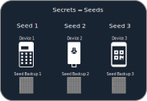
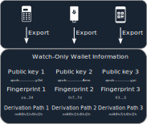

# Multisig Guide

## What is Single-sig?

You are probably familiar with using 1 *signing device* (also called *hardware wallet*) that generated 1 seed. 

Pros:

* 1 seed is all you need to access your funds
* 1 seed is simple
* Only 1 secure location to store the seed backup is needed

Cons:

* If you get tricked into giving hackers your seed your Bitcoin will be stolen immediately (see Phishing attacks [here](https://www.youtube.com/watch?v=B-09WDPXZmU)).    1 mistake on your part and the Bitcoin are lost.

## What is Multisig?

Multisig is a way to allow spending from your wallet only after 2 *signing devices* have signed the outgoing transaction.  These 2 *signing devices* can be any 2 out of 3 *signing devices*. This is called a *2 out of 3* multisig wallet.

Pros:

* Way more secure. 1 mistake cannot result in loss of funds. 
  * Useful for long term storage of significant funds

Cons:

* More complicated
* 3 secure locations to store the seed backups are needed
* *(master) public keys* need backup

#### Further information

* https://bitcoiner.guide/multisig/intro/#why-multisig

* https://btcguide.github.io/why-multisig

## How?

### Overview

You need 3 *signing devices* (see [here](multisig-security-tradeoffs.md) for a comparison), that generate 3 different seeds.

