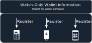

# Multisig Guide

This guide is meant as an overview only.  We encourage you to also read completely through:

- An **excellent** and comprehensive guide: [https://bitcoiner.guide/multisig](https://bitcoiner.guide/multisig)
- A **Video** step-by-step guide: 
- A step-by-step guide with the bitbox02: [https://shiftcrypto.ch/blog/specter-multisig-guide/](https://shiftcrypto.ch/blog/specter-multisig-guide/)

## What is Single-sig?

You are probably familiar with using 1 *signing device* (also called *hardware wallet*) that generated 1 seed.

Pros:

- 1 seed is all you need to access your funds
- 1 seed is simple
- Only 1 secure location to store the seed backup is needed

Cons:

- If you get tricked into giving hackers your seed your Bitcoin will be stolen immediately (see Phishing attacks [here](https://www.youtube.com/watch?v=B-09WDPXZmU)).    1 mistake on your part and the Bitcoin are lost.

## What is Multisig?

Multisig is a way to allow spending from your wallet only after 2 *signing devices*  (e.g. 2 *hardware wallets*) have signed the outgoing transaction.  These 2 *signing devices* can be any 2 out of 3 *signing devices*. This is called a *2 of 3* multisig wallet. (More complicated setups, e.g. 3 of 5, are possible but uncommon)

Pros:

- Way more secure! 1 mistake (e.g. 1 seed lost or stolen) cannot result in loss of funds.
  - Useful for long term storage of significant funds
  - If 1 seed was lost or stolen, all the funds can be transferred to a new setup with the 2 remaining seeds + all *(master) public keys*

Cons:

- More complicated
- 3 secure locations to store the seed backups are needed
- *(master) public keys* backup needed

#### Further information

- [https://bitcoiner.guide/multisig/intro/#why-multisig](https://bitcoiner.guide/multisig/intro/#why-multisig)
- [https://btcguide.github.io/why-multisig](https://btcguide.github.io/why-multisig)

## Overview

### 1. Seed creation

- You need 3 *signing devices* (ideally the 3 devices are from 3 different vendors), that generate 3 different seeds.
  - It is not strictly necessary to use 3 *signing devices* of different vendors to generate the 3 seeds. You could use 1 or 2 *signing devices* in total, generate a seed, reset the device, generate a seed, and so on. While this might not offer all the [benefits](https://btcguide.github.io/why-multisig) of multisig (like protection against a compromised random-number generator), it is significantly cheaper and needs fewer locations to store the *signing devices* in.

- The 3 seeds need to be stored on steel to survive long term, and be resistant to fire and water. ([Comparison](https://jlopp.github.io/metal-bitcoin-storage-reviews/) and the [cheap version](https://www.econoalchemist.com/post/backup))

You should have now:

#### Seed storage locations

This is a crucial part of the setup and needs **careful consideration**. Only if you choose these locations well you get the benefits (see [https://bitcoiner.guide/multisig/intro/#multisig-benefits](https://bitcoiner.guide/multisig/intro/#multisig-benefits)). Here a few points to pay attention to:

- Seed backups (on steel) are not protected by a pin as the *signing device*s (e.g. *hardware wallets*). They therefore need a **secure location**, i.e. accessible only to you or people you completely trust.
  - Examples are: Home/apartment, Safe deposit box, a relatives (or very good friends) home/apartment
- In 1 location there should not be more than 1 seed
  - Minimum is: 3 **secure locations**, in each location is the signing device and its seed backup
  - Ideal is: 3 **secure locations** for the seed backups **and** 3 (medium) secure locations for the *signing device*s (e.g. *hardware wallets*). The *signing device*s are themselves electronic vaults protected by the pin and do not need such a high security as the seed backups.
- Please read: [https://bitcoiner.guide/multisig/backup]( https://bitcoiner.guide/multisig/backup)

### 2. Multisig wallet creation with Specter Desktop

From each seed the *signing device*  (e.g. *hardware wallet*)  will calculate 

- the *(master) public key* (also called *xpub*)
- the [*fingerprint*](https://github.com/bitcoin/bips/blob/master/bip-0032.mediawiki#Key_identifiers) (The *BIP32 Root Fingerprint* is a short string, e.g. "3d2adeb9").

These can be exported (via USB, QR-Code, or SD-Card) to Specter Desktop:

- Specter Desktop will take the *(master) public key*s together with the *derivation paths* (for segwit multisig the standard is "m/48h/1h/0h/2h") to construct the (watch-only) wallet. The *fingerprints* are important, when then *signing devices* sign transactions.
- **Keep a copy of all *(master) public keys* and *fingerprints* (i.e. the Specter "Printable PDF backup") with every seed backup**.  They allow anyone to recreate the (watch-only) wallet and see the Bitcoin balance, and therefore should be kept **private**.

### 3. Register the multisig setup with each *signing device*  (e.g. *hardware wallet*)

*Signing devices* can import (via USB, QR-Code, or SD-Card) the multisig-wallet file from Specter Desktop (Wallet --> Settings --> Export --> Export to wallet software).

- Then the *signing device* knows it's parts of a multisig setup and can protect against various attacks.
- Then *signing device* can display receive addresses of the multisig setup.

For different vendors the registering works slightly different: [Notify Coldcard](https://bitcoiner.guide/multisig/wallet/#notify-coldcard), [Notify Cobo/Keystone](https://bitcoiner.guide/multisig/wallet/#notify-cobo), [Register Bitbox02](https://shiftcrypto.ch/blog/specter-multisig-guide/#register-the-multisig-wallet-on-the-bitbox02) 

#### Signing device comparison

As mentioned above, registering the multisig setup on the hardware device is important. Below we show  a table ([initial source](https://shiftcrypto.ch/blog/how-nearly-all-personal-hardware-wallet-multisig-setups-are-insecure/)) of those supporting the most important features for a multisig setup: 

|                                      | [BitBox02](https://shiftcrypto.ch/) | [Ledger](https://www.ledger.com/) | [Trezor](https://trezor.io/) | [Coldcard](https://coldcard.com/) | [Specter DIY](https://github.com/cryptoadvance/specter-diy) | Cobo Vault / [Keystone](https://keyst.one/) |
| ------------------------------------ | ----------------------------------- | --------------------------------- | ---------------------------- | --------------------------------- | ----------------------------------------------------------- | ------------------------------------------- |
| Display own xpub on demand           | ✅                                   | ❌                                 | ❌                            | ✅                                 | ✅                                                           | ✅                                           |
| Display cosigner xpubs               | ✅                                   | ❌                                 | ✅                            | ✅                                 | ✅                                                           | ✅                                           |
| Show SLIP-132 formats (`Ypub, Zpub`) | ✅                                   | ❌                                 | ❌                            | ✅                                 | ✅                                                           | ✅                                           |
| Register xpubs inside the device     | ✅                                   | ❌                                 | ❌                            | ✅                                 | ✅                                                           | ✅                                           |

### 4. Testing all parts of the setup

Because the multisig setup is more complicated, testing all parts of the setup is even more important.

#### 4.1 Fund with small amount

Send a small amount to the multisig wallet: [https://bitcoiner.guide/multisig/receive/](https://bitcoiner.guide/multisig/receive/)

#### 4.2 Recreate from the seed backups

Crucial is that you backed up each seed correctly (on steel).  Do this only if there are **small** funds on the multisig setup:

- Wiping/Resetting all *signing devices* (also known as *hardware wallet*)

- Restore the *signing devices*  from the steel backups

#### 4.3 (Watch-only) Wallet test

- Recreate the (watch-only) wallet with a different software, e.g. Sparrow Wallet, instead of Specter Desktop. For this export the *(master) public keys* together with the *derivation paths* again from all *signing devices*. See here: [https://bitcoiner.guide/multisig/recover/](https://bitcoiner.guide/multisig/recover/)
- If your transaction with the small amount appears in Sparrow Wallet **identical** to Specter Desktop your (Watch-only) Wallet test recreation was successful.

#### 4.4 Spend test

The last test is to test that you are able to spend from the multisig setup. For this send the small funds to a completely different wallet (e.g. a phone wallet) (See here: [https://bitcoiner.guide/multisig/spend/](https://bitcoiner.guide/multisig/spend/)). If the different wallet (e.g. a phone wallet) receives this transaction, then this test was successful too and you are ready to fund the multisig setup with larger amounts.

