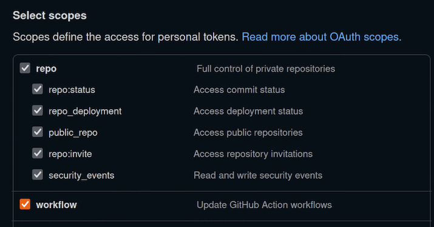
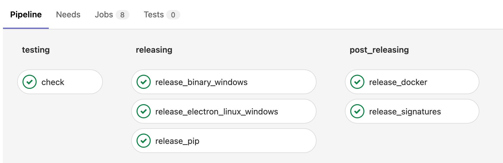
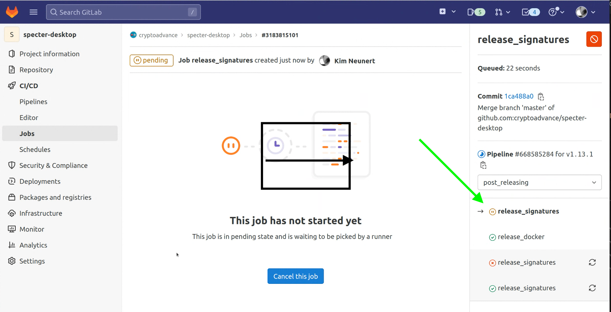

# Release Guide

## Creating release notes

### Pre-requisites

- You need the correct upstream master. You should see

```bash
git remote -v | grep upstream
upstream        git@github.com:cryptoadvance/specter-desktop.git (fetch)
upstream        git@github.com:cryptoadvance/specter-desktop.git (push)
```

- You need a GitHub token:
  If you don't have one, get one here https://github.com/settings/tokens and make sure to tick the boxes for repo and workflow as below:



Using the new token, run

```bash
export GH_TOKEN=YOURTOKEN
```

- You need Docker running
- Checkout the master branch and ensure a clean workspace.

Now, you can run

```bash
./utils/release.sh --release-notes
```

Or, if you want to directly set the new version:

```bash
./utils/release.sh --new-version v1.13.1 --release-notes
```

## Creating a new tag

Update your master branch after the release notes PR ([example](https://github.com/cryptoadvance/specter-desktop/commit/65ff6959d7fd85cba745e4d454b30031839f857f/)) has been merged and then run:

```bash
git tag v1.13.1 && git push upstream v1.13.1
```

## GitLab - releasing stage

Creating a tag triggers the release process of the GitLab runners.
There exists a mirror of the GitHub repo on GitLab, but only when a tag is created on GitHub will the release part of the runners execute. You can check the status here:
https://gitlab.com/cryptoadvance/specter-desktop/-/pipelines

There are three stages:


The first relevant stage is "releasing". Here, the Windows, Linux and pip release are created and uploaded to the Specter Desktop GitHub releases page. After this stage, the following artificats should be available:

- cryptoadvance.specter-1.13.1.tar.gz
- Specter-Setup-v1.13.1.exe
- specterd-v1.13.1-win64.zip
- specterd-v1.13.1-x86_64-linux-gnu.zip
- specter_desktop-v1.13.1-x86_64-linux-gnu.tar.gz

The three jobs in more detail:

- release_binary_windows: is creating a binary for specterd and for Windows (Windows runner)
- release_electron_linux_windows: Creates a specterd for Linux, an AppImage for Linux and an executable for Windows (Linux runner).
- release_pip: Is releasing a pypi package on [pypi](https://pypi.org/project/cryptoadvance.specter/) and creates a tarball of the pip package for the GitHub release page (Linux runner).

For details look at `.gitlab-ci.yml`

## MacOS

Ideally, directly after the tag is created, start with the MacOS release. As the binaries of x86/arm64 are not compatible with each other, we need to build on two MacOS architectures.This has to be done manually, for now. There is a script for this. Start with the build on x86:

### MacOS x64 build

```bash
./utils/build-osx.sh  --version v2.0.5-pre4 --appleid "Satoshi Nakamoto (appleid)" --mail "satoshi@gmx.com" specterd package upload
```

This will create three artifacts on github:
* specterd-v2.0.5-pre4-osx_x64.zip
* SHA256SUMS-macos_x64
* SHA256SUMS-macos_x64.asc

### MacOS arm64 build

The electron application will get built on the arm architecture. As it needs to store the sha256 hash in the electron-app, the make-hash target
will not only hash the specterd but also download the other specterd and hash it.

```bash
./utils/build-osx.sh  --version v2.0.5-pre4 --appleid "Satoshi Nakamoto (appleid)" --mail "satoshi@gmx.com" specterd make-hash electron sign package upload
```

This will create three artifacts on github:
* Specter-v2.0.5-pre4.dmg
* specterd-v2.0.5-pre4-osx_arm64.zip
* SHA256SUMS-macos_arm64
* SHA256SUMS-macos_arm64.asc


## GitLab - post releasing

Back to GitLab, the final stage is "post releasing".

### release_signatures

In this job, the individual SHA256-hashes and signatures are combined into two final files:

- SHA256SUMS
- SHA256SUMS.asc

Everything, apart from the MacOS files, are pulled from the GitLab environment, the MacOS files from GitHub.
Don't forget to delete the four MacOS files (`SHA256SUMS-macos_arm64` and `SHA256SUMS-macos_arm64.asc` and the two corresponding `_x64` files) on the GitHub release page in the end.

This is difficult to automate as sometimes the manual steps has not succeeded while generating the SHASUM-files. As a result, those hashes are not included. So you might want to run this again. And you can, just delete the two generated files - `SHA256SUMS` and `SHA256SUMS.asc` and run the job again.

### release_docker

There are docker images created by the awesome [Chiang Mai LN dev](https://github.com/lncm/docker-specter-desktop). So the task of this job is to trigger their build-system which is done via `utils/trigger_docker_build.sh`. A prerequisite of this is a token in order to authenticate. That token is from Aaron, one of the maintainers of that repo, and can be found in the gitlab variables section of the CI/CD configuration.

### tag_specterext_dummy_repo

Sometimes there are changes on the plugin architecture. In order to create a plugin, it's quite important to know which version of the plugin system should be used. Because of that, we simply assume that the master of the [specterext-dummy](https://github.com/cryptoadvance/specterext-dummy) repo is compatible with the current master which was just tagged with the new version.
So this job will tag that repo with the same tag and the creation of a plugin will take the version into account.

## Trouble shooting

If the MacOS signatures are missing, it can happen that the following Exception will be raised:

```bash
  File "/builds/cryptoadvance/specter-desktop/utils/github.py", line 295, in download_artifact
  raise Exception(
  Exception: Status-cod04 for url ... )
```

In any case, if the macOS binaries arrive on GitHub too late, you have to manually delete the already created `SHA256SUMS` and `SHA256SUMS.asc`, otherwise the upload to GitHub will fail if you rerun the release signatures job on GitLab - for details see ([this PR](https://github.com/cryptoadvance/specter-desktop/pull/689)). The green arrow in the screenshot is where you rerun the release signatures job on GitLab:



## GitHub release page and download page

This is handled by the script `./utils/generate_downloadpage.sh`. As a prerequisite, you need to clone the `specter-static` repo which contains the specter website. Clone it on the same level than specter-desktop.
Running that script will:

- install the prerequisites (basically markdown, see pyproject.toml)
- generate the GH-page and the download-page based on the `utils/templates`.
- Asks whether it should replace/update/initialize the Github Release page for the latest version
- copies over the new download-pages and asks whether it should commit/push those
