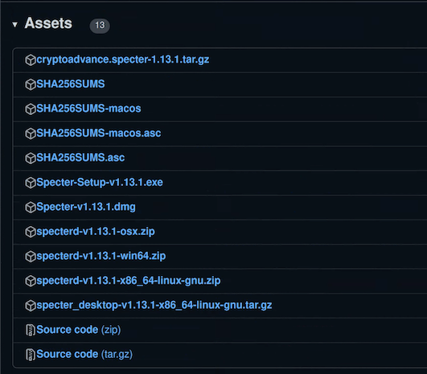

### Creating release notes
#### Pre-requisites
- You need the correct upstream master. You should see
```bash 
upstream  git@github.com:cryptoadvance/specter-desktop.git
```
when you run
```bash
git remote -v
```
- You need a GitHub token:
If you don't have one, get one here https://github.com/settings/tokens and make sure to tick the boxes for repo and workflow as below:

Using the new token, run
 ```bash
 export GH_TOKEN=YOURTOKEN
 ```
- Checkout the master branch and ensure a clean workspace.

Now, you can run
```bash
./utils/release.sh --release-notes
```
Or, if you want to directly set the new version:
```bash
./utils/release.sh --new-version v1.13.1 --release-notes
```
### Creating a new tag
Update your master branch after the release notes PR ([example](http:/https://github.com/cryptoadvance/specter-desktop/commit/65ff6959d7fd85cba745e4d454b30031839f857f/)) has been merged and then run:
```bash
git tag v1.13.1 && git push upstream v1.13.1
```
### GitLab - releasing stage
Creating a tag triggers the release process of the GitLab runners. 
There exists a mirror  of the GitHub repo on GitLab, but only when a tag is created on GitHub will the release part of the runners execute. You can check the status here: 
https://gitlab.com/cryptoadvance/specter-desktop/-/pipelines

There are three stages:


The first relevant stage is "releasing". Here, the Windows, Linux and pip release are created and uploaded to the Specter Desktop GitHub releases page. After this stage, the following artificats should be available:

cryptoadvance.specter-1.13.1.tar.gz
Specter-Setup-v1.13.1.exe
specterd-v1.13.1-win64.zip
specterd-v1.13.1-x86_64-linux-gnu.zip
specter_desktop-v1.13.1-x86_64-linux-gnu.tar.gz

The three jobs in more detail:
release_binary_windows: is creating a binary for specterd and for Windows (Windows runner)
release_electron_linux_windows: Creates a specterd for Linux, an AppImage for Linux and an executable for Windows (Linux runner).
release_pip: Is releasing a pypi package on [pypi](https://pypi.org/project/cryptoadvance.specter/) and creates a tarball of the pip package for the GitHub release page (Linux runner). 

For details look at `.gitlab-ci.yml`

### MacOS
Ideally, directly after the tag is created, start with the MacOS release. This has to be done manually, for now. There is a script for this:
```bash
./utils/build-osx.sh  --version v1.13.1 --appleid "Satoshi Nakamoto (appleid)" --mail "satoshi@gmx.com" make-hash specterd electron sign upload
```

This script also runs `github.py upload `, so two more binares and the hash and signature files are uploaded to GitHub:

Specter-v1.13.1.dmg
specterd-v1.13.1-osx.zip
SHA256SUMS-macos
SHA256SUMS-macos.asc

### GitLab - post releasing
Back to GitLab, the final stage is "post releasing". 

In this stage, the invididual SHA256-hashes and signatures are combined into two final files:
SHA256SUMS
SHA256SUMS.asc

Everything, apart from the MacOS files, are pulled from the GitLab environment, the MacOS files from GitHub.
Don't forget to delete the two MacOS files (`SHA256SUMS-macos` and `SHA256SUMS-macos.asc`) on the GitHub release page in the end.

### All assets on GitHub

This should be the final result of all uploaded assets and files:



### Trouble shooting
If the MacOS signatures are missing, the following Exception will be raised:
```bash
  File "/builds/cryptoadvance/specter-desktop/utils/github.py", line 295, in download_artifact
  raise Exception(
  Exception: Status-cod04 for url ... )
```
If the macOS binaries arrive on GitHub too late, you have to manually delete the already created `SHA256SUMS` and `SHA256SUMS.asc` and rerun the job release signatures in the latest stage on GitLab:


### Editing the text on the GitHub release page
We are running a script here to create a markdown file that can be used for copy and paste.
Checkout this repo: `git@github.com:cryptoadvance/corp-notes.git`
`cd download`
Follow the instructions in `README.md`
`./build.sh`

The result `gh_page.md` can then be found in the build directory.
Edit the release on GitHub and paste this md-file there.

### Website 
The above script also produces html files for the website (in the same directory):
`download-page_current.html`
`download-page_releases.html`

Login into:
https://specter.solutions/wp-login.php

Go to "Pages"
Edit "Specter Desktop - Elementor" with Elementor
Click somewhere on 1 (see screenshot), then somewhere on 2, select all, delete, and paste
`download-page_current.html`

Then click update
Be careful, not to paste the templates, otherwise you will see nasty jinja tags. 

Do the same for this part of the website, just, in this case, replace it with 
`download-page_releases.html`

