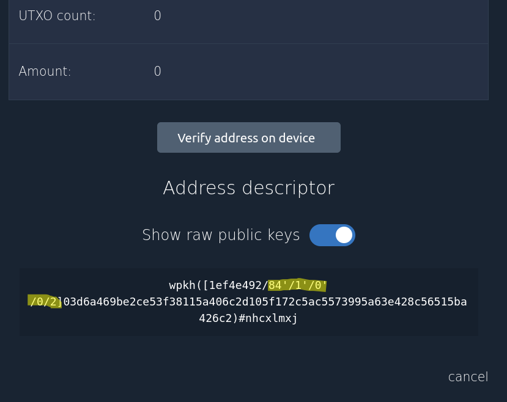
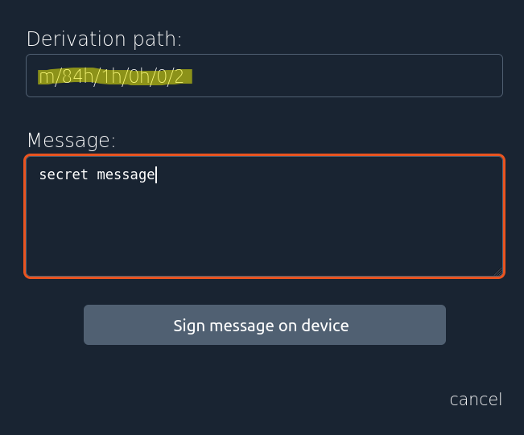
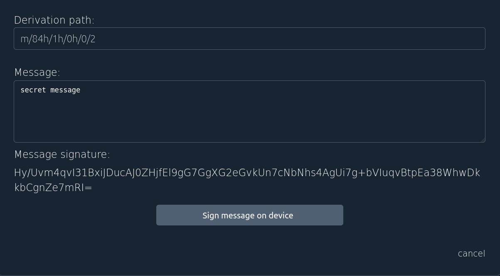

Signing a message is currently quite complicated in Specter and only available for USB-based singlesig-wallets. Here is a short description:

1. Got to your wallet->Addresses and click on the address you want to sign your message with. In this example the address is `bcrt1qxak08ykhf7r4js9yncysy5p05xp0fwxhamewc8`
2. Check the derivation path at the very bottom marked in yellow. In this example it's `/84'/1'/0'/0/2`

3. Go to the device and click on `sign message on device`. Enter the derivation path by converting the `'` into h and add a `m` and enter your message

4. After signing on the device, you get your signature. 

5. In this example the message is "secret message" and the signature is: `Hy/Uvm4qvI31BxiJDucAJ0ZHjfEl9gG7GgXG2eGvkUn7cNbNhs4AgUi7g+bVIuqvBtpEa38WhwDkkbCgnZe7mRI=`
6. To verify the message, make sure that the service which is doing the verification is able to verify messages with segwit-addresses. [https://www.verifybitcoinmessage.com/](https://www.verifybitcoinmessage.com/) is one which can do that. This is only an example and not an endorsement of that service! Watch out, it's your privacy!
7. Enter the adddress, the message and the signature in there and you get a valid signature.