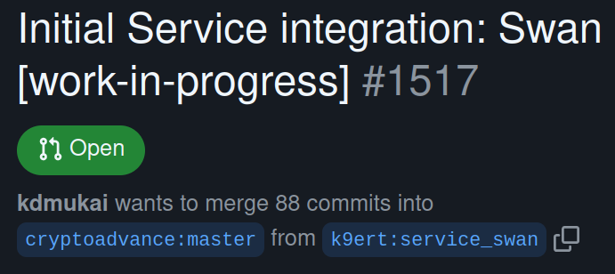

# Introduction

You have a production system and you want to keep it running. Upgrades to Specter are usually not that tricky. You simply download the new app and you can usually rollback to the older version in most cases.

However, sometimes you want to test a new feature from a PR, a release candidate or a new Specter service which is in beta and you don't want to interfere with your production system. So how can you do that?

We'll discuss here some hints on separating environments and maybe even running installations in parallel. At the end, we will show how to make a copy of the production system and let it run completely in parallel with the existing system. But, first, let's look at the building blocks.

## On specterd, branches and PRs

We'll assume here, that you're a little familiar with the command line. If a change has been made but not yet released, there are several ways how the change could already be available. Here are the possibilities:

The easiest one is a release candidate. This would be available in the [Release-section](https://github.com/cryptoadvance/specter-desktop/releases) on GitHub. We'll assume here that we start the Specter release on the command line, so please download the corresponding `specterd` for your platform.

The same is true for release candidates from forks of the project. In that case, you'd simply download the `specterd` from the release-page of that fork. In both cases, at least in linux, you have to make the `specterd` executable. You can do that via the UI or, preferably, via the command line with a command like `chmod u+x ./specterd`.

Let's now assume that you would like to try out a feature from a PR. In that case, you would need a [developmenet-environment](https://docs.specter.solutions/desktop/development/#set-up-virtualenv). However after cloning the repo (first command in the link), you need to change to the fork/branch mentioned in the PR. You can see the fork branch if you navigate to the PR. Here is an example:

So the branch, in this case, is called `service_swan`. The branch is located in a fork by the user `k9ert`. So, in order to update the code you just cloned from GitHub you do this:
```
git checkout -b k9ert-service_swan master
git pull https://github.com/k9ert/specter-desktop.git service_swan
```
Adjust the branch/user accordingly. After that, continue to setup your environment as described in the link above.
If you need a more comprehensive guide, you can check out (what a pun!) [this blog post](https://snyk.io/blog/git-checkout-remote-branch/).

## specterd binary or source cli

No matter whether you've downloaded a specterd binary or you've cloned/checked out a specific environment, you're ready to start Specter via the cli. A specterd would be started as follows
```
$ ./specterd
Initializing HWI...
Usage: specterd [OPTIONS] COMMAND [ARGS]...

Options:
  --debug                     Show debug information on errors.
  --tracerpc / --no-tracerpc  Will trace all calls to BitcoinCore or
                              ElementsCore if in --debug

  --help                      Show this message and exit.

Commands:
  bitcoind   This will start a bitcoind regtest and mines a block every...
  elementsd  This will start a bitcoind regtest and mines a block every...
  server
```
The very same output you would get if you do a `$ python3 -m cryptoadvance.specter`.
We can get additional information by running:

```
$ ./specterd server --help 
Initializing HWI...
Usage: specterd server [OPTIONS]

Options:
  --port TEXT                 TCP port to bind specter to
  --host TEXT                 if you specify --host 0.0.0.0 then specter will
                              be available in your local LAN.

  --cert TEXT                 --cert and --key are for specifying and using a
                              self-signed certificate for SSL encryption.

  --key TEXT                  --cert and --key are for specifying and using a
                              self-signed certificate for SSL encryption.

  --ssl / --no-ssl            By default SSL encryption will not be used. Use
                              -ssl to create a self-signed certificate for SSL
                              encryption. You can also specify encryption via
                              --cert and --key.

  --debug / --no-debug
  --filelog / --no-filelog
  --tor
  --hwibridge                 Start the hwi-bridge to use your HWWs with a
                              remote specter.

  --specter-data-folder TEXT  Use a custom specter data-folder. By default it
                              is ~/.specter.

  --config TEXT               A class from the config.py which sets reasonable
                              default values.

  --help                      Show this message and exit.
```

The relevant switches are `port`, `specter-data-folder` and config. Before we explain those, let's clarify what you get if you start Specter like this on the command line.

```
python3 -m cryptoadvance.specter server
Initializing HWI...
[2022-01-13 10:29:51,415] INFO in server: Configuration: cryptoadvance.specter.config.ProductionConfig
[lotsOfOutput]
[2022-01-13 10:30:07,560] INFO in _internal:  * Running on http://127.0.0.1:25441/ (Press CTRL+C to quit)
[aBitMoreOutput]
```
As you can see from the output, Specter is now running on your local machine and you can go visit it by following the link shown: [http://127.0.0.1:25441/](http://127.0.0.1:25441/). You can stop Specter again, by pressing `CTRL+C` in the terminal.

## The specter-data folder and port

As almost all programs on a computer Specter needs a place to store its data. Specter uses no databases only files on disk. These files are all located in a single directory, usually in your homefolder called `.specter`. The dot in the name makes that directory hidden, so you might need to switch to `show-hidden-files` in your filebrowser or use the a-switch in ls (`ls -a`).

Now, you know where your production data is stored. Maybe you want to make a backup. If you use an internal Bitcoin node, then this directory might take up 4 GB or more. If not, it's only a few kB big. You can zip that directory in linux like:
```
zip -r specter-prod.zip .specter
```
Obviously, that might not make so much sense, if there is an internal node stored in that directory. In this case, you can still zip that folder by:
```
zip -r specter-prod.zip .specter -x ".specter/nodes/*"
```
You can also start Specter with a different data folder. For example:
```
$ ./specterd server --specter-data-folder ~/.specter_manual_test
```
It doesn't matter whether the directory exists. If not, it will be created automatically. Specter is now using a different data folder, but it's still  running on the same port. You can choose a different port via:
```
$ ./specterd server --specter-data-folder ~/.specter_manual_test --port 26441
```
You will then find this instance running at [http://127.0.0.1:26441/](http://127.0.0.1:26441/). The nice thing is, that you can run Specter instances in parallel if they run on different ports.

## Configurations

Running a development environment has different requirements than a production env, e.g.:
* You want debugging messages
* You don't want to relogin just because the server restarted
* You don't want to mess with the `~/.specter` data-folder
* You want all the potential service integrations to be available, even if they are alpha

That set of configurations can be passed over by referencing the `DevelopmentConfig` from `config.py` like this:
```
$ ./specterd server --config DevelopmentConfig --debug
```

## Walkthrough

So let's assume you want to run a test system almost completely separate from your production system. The only thing which is shared is the external Bitcoin Core node. So here are the steps:

1. Zip the data folder
```
zip -r specter-prod.zip .specter -x ".specter/nodes/*"
```
2. Unzip in new folder
```
unzip specter-prod.zip -d /tmp
mv /tmp/.specter .specter_copy
```
3. Start with new folder (and port)
```
$ ./specterd server --config DevelopmentConfig --debug --specter-data-folder ~/.specter_copy --port 27441
```

Note: When you are running Specter with the DevelopmentConfig a folder called `specter_dev` is automatically created. You could also use this folder for the above.
