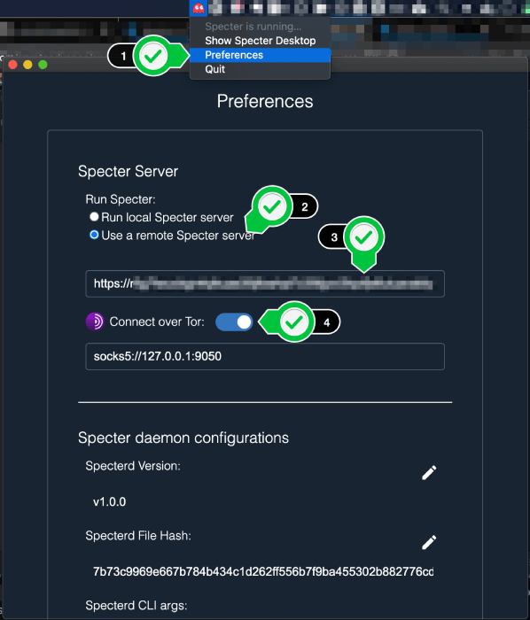

# Tor and Specter Desktop

When using Specter Desktop, there might be certain cases where you would want to make calls over the Tor network. The simplest way to setup Tor integration with Specter Desktop is to click on the "Get Started" button of the welcome page and follow the setup wizard, which will install and configure Tor for you. You can also access it by going to `Settings -> Tor` tab, and clicking on "Setup Tor".


These will take you through the one click setup process, just click "Setup Tor" and Specter will take care of installing, configuring and running the Tor daemon.


## Running Specter Desktop over a Tor hidden service

Specter Desktop protects your security and privacy by running on a local server that only talks to your own Bitcoin node. But what if you need to check a wallet balance or generate and sign transactions when you're away from your home network?

Configuring your router to let you VPN into your home network is probably the easiest solution.

But you can also make Specter Desktop available outside of your network via a Tor hidden service. A hidden service generates an .onion address so Specter can be accessed from a Tor browser from anywhere in the world. This does not require any port forwarding on your router.

Make sure authentication is enabled to avoid access to your Specter by random strangers in the internet. It can be configured in the `Settings -> Authentication` tab. "Password Protection" would be the simplest authentication option, and you would normally want to select it in this case.

After setting up authentication, running the hidden service to remotely access specter is as easy as going to the `Settings -> Tor` tab, scrolling to the bottom and clicking the "Start" button under the "Tor Hidden Service" section.


## Manual Tor configurations

### Setting up Tor using the Tor Browser
The easiest way to use Tor with Specter is to have the [Tor Browser](https://www.torproject.org/download/) open. Just install it on your computer, open it and it will expose a Tor proxy Specter can connect to.
To set this up, you'll just need to go to Specter's `Settings -> Tor` tab, then set the Tor Proxy field to: `socks5://127.0.0.1:9150` (you'll see it listed below the field as the Tor Browser default URL). Then click save and Specter should be working with Tor - just make sure to keep your Tor Browser running while using Specter.

### Install Tor service
Alternatively, you can setup the Tor service. Install Tor on the same server that you'll be running Specter Desktop:
* [Debian / Ubuntu](https://2019.www.torproject.org/docs/debian.html.en)
* Raspberry Pi OS: `sudo apt install tor`
* [macOS](https://2019.www.torproject.org/docs/tor-doc-osx.html.en)

### Configure Specter Desktop for Remote Instance
If you're using Specter Desktop on a remote machine and would like to connect to it over Tor (to use hardware wallets for example), then follow these steps to set up the app to connect to your remote Specter server.


1. Open Preferences
2. Choose "remote Specter server"
3. Enter your TOR URL
4. Switch on "Connect over TOR"



After saving, Specter will shutdown. Start it again and you should be able to connect to your remote Specter server.

### Configure Tor
#### Hash Specter's `torrc_password`
First you'll need to copy your `torrc_password` from the Specter `config.json` (found in `~/.specter` by default).

Then hash the password using Tor's built-in command:
```
$ tor --hash-password your_torrc_password
16:6FB92F9B361D347060D6D2E95E810604DC55A22D38492F28C51F2AACDF
```

Copy the `16:...` hashed password and save it for the next step

#### Edit `torrc`
Update your `torrc` config file (usually `/etc/tor/torrc`; Mac OS homebrew: `/usr/local/etc/tor/torrc` or `/opt/homebrew/etc/tor/torrc`) and uncomment the `ControlPort` and `HashedControlPassword` lines. Paste in your `16:...` hashed password here:
```sh
## The port on which Tor will listen for local connections from Tor
## controller applications, as documented in control-spec.txt.
ControlPort 9051
## If you enable the controlport, be sure to enable one of these
## authentication methods, to prevent attackers from accessing it.
HashedControlPassword your_hashed_password
```

Restart the Tor service:
* `sudo /etc/init.d/tor restart` on Linux
* `brew services restart tor` on macOS Homebrew installs

On Linux you also need to add yourself to the Tor group (depends on the system `debian-tor` on Ubuntu):
```sh
usermod -a -G debian-tor `whoami`
```

### Running with Tor using command line

You can start the server using `--tor` flag or enable it in the web interface:

```sh
$ python3 -m cryptoadvance.specter server --tor
```

Among the startup output you'll see:
```
...
* Started a new hidden service with the address of blahblahbla123asbfdgfd.onion
```

Point a Tor browser at that onion address and you will have (reasonably?) secure access to your Specter Desktop from anywhere in the world!

Each time Specter Desktop restarts the same onion address will be re-enabled.

If you'd like to discard the existing onion address and force the creation of a new one, simply delete the `.tor_service_key` in the `~/.specter` folder and restart Specter Desktop.
